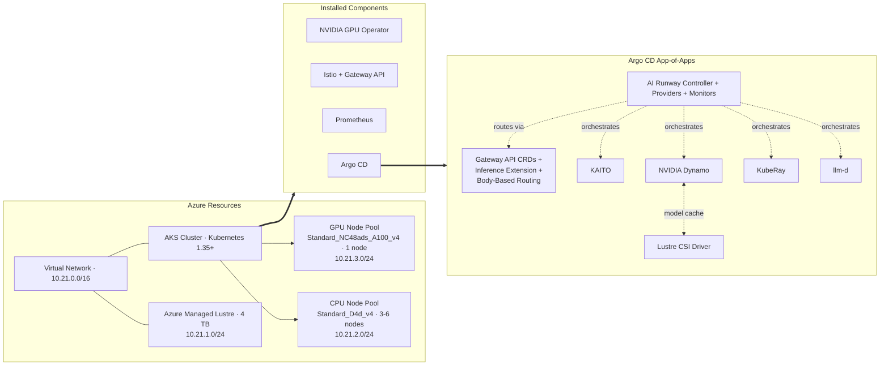
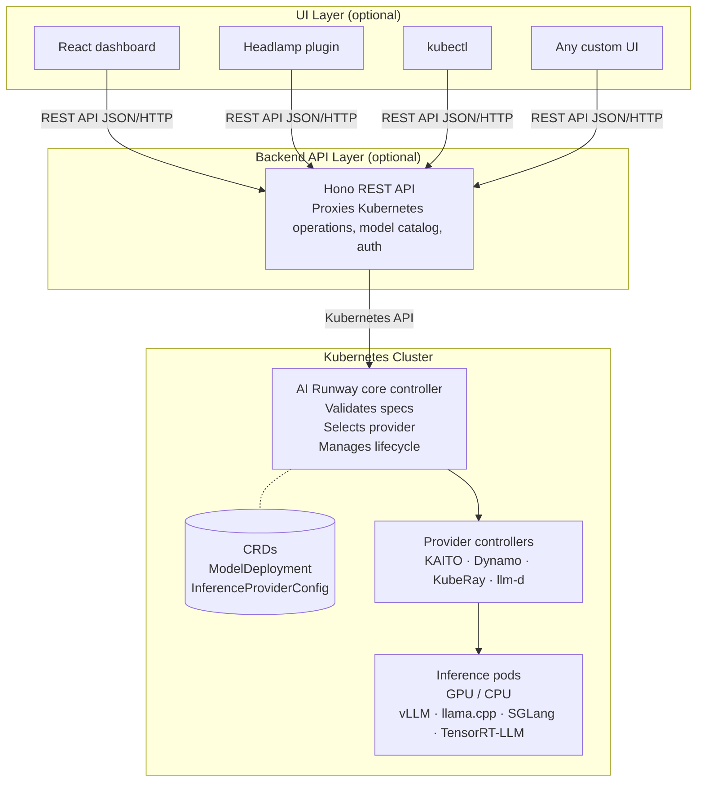

# AKS LLMs: Prototype to Production on AKS

This demo shows how to take an LLM from experiment to production on Azure Kubernetes Service (AKS) with AI Runway.

The goal is to keep the path easy to follow: provision the cluster, connect to it, and then let AI Runway handle model deployment, routing, and operational concerns across multiple inference backends.

## Demo Goal

By the end of this demo, you should understand how to:

- Deploy an LLM on AKS using CPU and GPU node pools.
- Use AI Runway as a single interface for multiple inference backends.
- Add production-style routing, scaling, and monitoring.
- Manage the platform through GitOps with Argo CD.

## What AI Runway Does

AI Runway is an open-source project that treats model deployments as native Kubernetes resources.

In practice, that means you describe what you want to run, and the controller handles the provider-specific work behind the scenes.

### Why Use It

- One interface for multiple providers.
- Less infrastructure work for AI teams.
- Automatic provider and engine selection based on the spec.
- Built-in support for GitOps, monitoring, and scalable deployment patterns.

### Compared With The Traditional Approach

| Without AI Runway | With AI Runway |
| --- | --- |
| Learn each provider's CRDs and configuration separately | Use one `ModelDeployment` CRD across providers |
| Manually match models to the right backend and engine | Let the controller select the backend and engine |
| Configure routing resources for each model by hand | Create gateway resources automatically |
| Track status per provider in different ways | Use unified status conditions and Prometheus metrics |
| Write provider-specific YAML for every deployment | Describe the desired outcome and let the controller handle the rest |

> [!NOTE]
> AI Runway does not replace inference providers. It sits above them and gives you one consistent interface.

## Prerequisites

Make sure these tools are available before you start the demo:

| Tool | Purpose |
| --- | --- |
| [Azure CLI](https://learn.microsoft.com/cli/azure/install-azure-cli) | Manage Azure resources and AKS credentials |
| [kubectl](https://kubernetes.io/docs/tasks/tools/) | Work with the Kubernetes cluster |
| [Bun](https://bun.sh) | Run the AI Runway dashboard |
| [Helm](https://helm.sh/docs/intro/install/) | Install supporting components |
| [jq](https://jqlang.org/) | Parse JSON output from `kubectl` and `curl` |
| [yq](https://github.com/mikefarah/yq) | Parse YAML output from `kubectl` |
| [Git](https://git-scm.com/) | Clone and manage the repository |
| [Argo CD CLI](https://argo-cd.readthedocs.io/en/stable/cli_installation/) | Optional GitOps checks |
| [GitHub Copilot CLI](https://github.com/features/copilot/cli/) | Optional terminal assistant, version 1.0.44 or later |
| [Visual Studio Code](https://code.visualstudio.com/download) | Recommended editor, version 1.120.0 or later |

## Provision The Infrastructure

This repository includes Terraform that provisions the demo environment.

Start with Azure authentication:

```bash
az login
```

Then move into the infrastructure folder and apply the configuration:

```bash
cd src/infra
terraform init
terraform apply
```

This creates:

- A resource group.
- An AKS cluster with CPU and GPU node pools.
- Azure Managed Lustre storage.
- The application platform bootstrap through Argo CD.

## High-Level Architecture



## Connect To The Cluster

After Terraform finishes, capture the outputs and request credentials:

```bash
RG_NAME=$(terraform output -raw rg_name)
AKS_NAME=$(terraform output -raw aks_cluster_name)

az aks get-credentials \
  --resource-group $RG_NAME \
  --name $AKS_NAME \
  --overwrite
```

> [!NOTE]
> This demo requires Azure quota for the GPU VM SKU `Standard_NC48ads_A100_v4`. Request quota increases early, because approval can take time.

Verify that the cluster connection works:

```bash
kubectl cluster-info
```

If everything is wired up correctly, you should see the Kubernetes control plane and CoreDNS endpoints.

## How The Demo Is Organized

Think of the demo in two layers:

1. Terraform builds the base Azure and AKS environment.
2. Argo CD applies the app-of-apps pattern and installs the AI Runway stack plus its supporting components.

That means the infrastructure is created first, then the Kubernetes workloads are layered on top during cluster provisioning.

## Notes On The Manifests

The manifests in this demo are managed by Argo CD using an app-of-apps pattern.

The root application bootstraps the child applications for AI Runway, KAITO, Dynamo, Gateway API, KubeRay, and the Lustre CSI driver. Those workloads are applied automatically during cluster provisioning, and the workshop modules reference the individual manifests when you need to make changes.

## Demo Summary

This Demo is about showing the full path from prototype to production for LLMs on AKS.

The important takeaway is that AI Runway gives you a single Kubernetes-native control plane for model deployment, while AKS, Terraform, and Argo CD handle the underlying platform and delivery workflow.

## Demo 1: Deployment & Core Concepts

In this demo, I will show you how to:

- Deploy your first **ModelDeployment** from a manifest.
- See how AI Runway separates what you want to run from how it gets run.
- Identify the purpose of the **ModelDeployment** and **InferenceProviderConfig** CRDs.
- Read deployment status conditions so you can see what the controller is doing.

Start by creating your first AI Runway `ModelDeployment` resource. This manifest deploys a small CPU-based Gemma2 model. It intentionally leaves out the provider and engine so AI Runway can choose them automatically.

```bash
kubectl apply -f C:\AKS_LABS\AKS_AI_and_LLM\AI_Runway\demo_yaml\cpumodel.yaml
```

Expected output:

```text
modeldeployment.airunway.ai/gemma2-2b-cpu created
```

> [!NOTE]
> This manifest includes `spec.image` because CPU-based models need a pre-built model server image. GPU-based models do not need this field because the provider handles image selection.

Confirm that the resource exists:

```bash
kubectl get modeldeployment gemma2-2b-cpu
```

The deployment may not be ready yet. That is expected, because the controller is still working through its startup lifecycle.

### How AI Runway works

- AI Runway separates your **intent** from the **implementation**.
- Your intent is the model, engine, and resources you want.
- The implementation is the backend that actually runs it, plus the setup it needs.
- You describe what you want in a `ModelDeployment`, and the controller handles provider selection, resource creation, and gateway routing.

> [!NOTE]
> Think of it like a universal remote: the `ModelDeployment` is the remote, and the provider is the device behind the TV that actually does the work.

In simple terms, a provider is the part of the system that actually hosts and serves the model. AI Runway picks the provider for you based on the deployment you described, so you do not have to manage each backend manually.

The resource you just created is a good example: one Kubernetes object represents the full model deployment, even though a provider is doing the actual work behind the scenes. In this demo, examples of providers include KAITO, NVIDIA Dynamo, KubeRay, and llm-d. AI Runway looks at your ModelDeployment and picks one of those backends to serve the model for you.

### Architecture Overview

AI Runway is split into three layers: the Kubernetes cluster, an optional backend API, and an optional UI.



#### Key Design Points

| Principle | What it means |
| --- | --- |
| Core controller is minimal | It validates specs, selects providers, manages routing, and updates status. |
| Provider controllers are out-of-tree | Each provider has its own controller, so it can be versioned and released independently. |
| UI is optional | You can use kubectl and CRDs directly; the web UI is only a convenience layer. |
| Two-tier reconciliation | The core defines the interface, and providers implement it, similar to how CRI works in Kubernetes. |

> [!NOTE]
> Just like the kubelet talks to containerd through CRI and does not care whether you use containerd or CRI-O, the AI Runway core controller talks to providers through a standard interface. You can swap providers without changing your `ModelDeployment` specs.

### The ModelDeployment CRD

`ModelDeployment` is the main resource you work with in this demo. You describe what model you want and what resources it needs.

The Gemma deployment you just applied asked for a Gemma2 2B model with 1 CPU. AI Runway handled the rest: it found a provider that supports CPU workloads, selected an engine, created the Kubernetes resources, and started managing the lifecycle.

### Providers: The Inference Backends

A provider is the backend that actually runs your model. In simple terms, AI Runway picks the engine and backend for you so you do not have to wire everything up by hand.

Examples in this demo include:

- **KAITO** (CNCF Sandbox): LLM inference, fine-tuning, and RAG on Kubernetes with GPU auto-provisioning and support for vLLM-compatible Hugging Face models.
- **Dynamo** (NVIDIA): Distributed inference with disaggregated serving, smart KV cache routing, and dynamic GPU scheduling.
- **KubeRay**: Kubernetes operator for Ray workloads such as RayCluster, RayJob, and RayService.
- **llm-d** (CNCF Sandbox): Kubernetes-native distributed inference with LLM-aware routing, KV cache management, and multi-hardware support.

You do not need to learn every provider's configuration format. You describe the outcome you want, and the controller chooses the provider that fits.

### The InferenceProviderConfig CRD

Each provider registers itself with the cluster through an `InferenceProviderConfig`. This tells AI Runway what the provider can do, including which engines it supports, whether it handles CPU or GPU workloads, and which serving modes it offers.

Check the registered providers:

```bash
kubectl get inferenceproviderconfigs
```

Expected output:

```text
NAME      READY   VERSION                   AGE
dynamo    true    dynamo-provider:v0.2.0    1h
kaito     true    kaito-provider:v0.1.0     1h
kuberay   true    kuberay-provider:v0.1.0   1h
llmd      true    llmd-provider:v0.1.0      1h
```

You should see all four providers with `READY=true`. That confirms the controller knows which runtimes are available and healthy.

To inspect a provider in more detail, run:

```bash
kubectl get inferenceproviderconfig kaito -o yaml
```

Expected output, with metadata removed for brevity:

```yaml
spec:
  capabilities:
    cpuSupport: true
    engines:
      - vllm
      - llamacpp
    gpuSupport: true
    servingModes:
      - aggregated
  selectionRules:
    - condition: "!has(spec.resources.gpu) || spec.resources.gpu.count == 0"
      priority: 100
    - condition: spec.engine.type == 'llamacpp'
      priority: 100
status:
  ready: true
  version: kaito-provider:v0.1.0
```

> [!NOTE]
> The two parts to pay attention to are `spec.capabilities`, which tells you what the provider supports, and `selectionRules`, which tells you when it gets auto-selected. Because this demo asks for CPU, the controller should pick KAITO with the llama.cpp engine.

### Watch The Deployment Status

Now check what the controller decided for the Gemma deployment:

```bash
kubectl get modeldeployment gemma2-2b-cpu -o yaml | yq '.status'
```

You should see conditions similar to these:

```yaml
conditions:
  - message: Engine llamacpp auto-selected from provider kaito
    status: "True"
    type: EngineSelected
  - message: Provider kaito auto-selected
    status: "True"
    type: ProviderSelected
  - message: Workspace created successfully
    status: "True"
    type: ResourceCreated
  - message: All replicas are ready
    status: "True"
    type: Ready
  - message: InferencePool and HTTPRoute created
    status: "True"
    type: GatewayReady
engine:
  type: llamacpp
phase: Running
provider:
  name: kaito
  resourceKind: Workspace
  selectedReason: "matched capabilities: engine=llamacpp, gpu=false, mode=aggregated"
replicas:
  available: 1
  desired: 1
  ready: 1
```

> [!TIP]
> Read `status.conditions` from top to bottom. They tell the story of the deployment: validation, provider selection, resource creation, readiness, and gateway setup. If traffic is not flowing, this is the first place to check.

### Test The Model Endpoint

The model exposes an OpenAI-compatible API. For this demo, use `kubectl port-forward` to test it directly.

In a new terminal tab, start a port-forward to the KAITO workspace service:

```bash
kubectl port-forward svc/gemma2-2b-cpu 8080:80
```

In another terminal tab, send a chat request:

```bash
curl -s http://localhost:8080/v1/chat/completions \
  -H "Content-Type: application/json" \
  -d '{
    "model": "gemma-2-2b-instruct",
    "messages": [{"role": "user", "content": "What are the advantages and disadvantages of running models on Kubernetes?"}],
    "max_tokens": 50
  }' | jq
```

You should see a JSON response with the model reply. That confirms the model is running and serving an OpenAI-compatible API.

> [!NOTE]
> Later in the demo, you will see how the Gateway API Inference Extension routes traffic to multiple models through a single shared endpoint.

When you are done, press **Ctrl+C** in the port-forward terminal to stop it. You can close the extra terminal tab.
