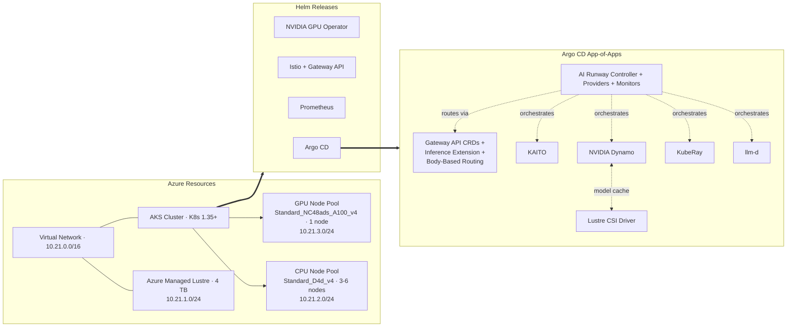

# AKS_LLMS_prototype_to_prod : Take LLMs from prototype to production on AKS

This is demo with notes on how you can Take LLMs from prototype to production on AKS.

Moving an AI model from experiment to production is hard.

- This demo will teach users more about AI Runway, an open-source accelerator that simplifies deploying LLMs on Azure Kubernetes Service (AKS).
- By treating models as native Kubernetes resources, AI Runway offers a single interface that adapts to multiple inference backends. 
- Users will deploy a production LLM on AKS, implement custom resources for scaling and networking, configure GPU and latency monitoring, and integrate it into CI/CD pipelines.

## AI Runway

AI Runway is an open-source project that treats model deployments as native Kubernetes resources. It gives you a single interface that works across multiple inference backends.
- In this demo, we will deploy large language models (LLMs) on Azure Kubernetes Service (AKS) using both CPU and GPU nodes, configure production serving patterns, set up monitoring, and manage everything through GitOps with Argo CD.

## Why AI Runway?

Deploying LLMs in production means working with multiple inference providers, each with its own configuration format. AI Runway simplifies this with:

- **One interface for all providers**: Describe _what_ you want to deploy (model, engine, resources) and AI Runway figures out _how_.
- **Less operational overhead**: AI/ML teams focus on models, not infrastructure details.
- **Automatic provider and engine selection**: The controller picks the right inference provider and engine based on your spec.
- **Production patterns built in**: GitOps workflows, monitoring, and scalable deployment are supported out of the box.

The table below compares the traditional approach to deploying models on Kubernetes with the AI Runway approach:

| Without AI Runway                                                                                                 | With AI Runway                                                        |
| ----------------------------------------------------------------------------------------------------------------- | --------------------------------------------------------------------- |
| Learn each provider's CRDs and configuration (KAITO Workspaces, Dynamo DynamoGraphDeployments, RayServices, etc.) | One ModelDeployment CustomResourceDefinition (CRD) for all providers  |
| Manually match models to the right provider and engine                                                            | Auto-selects provider and engine based on your spec                   |
| Configure gateway routing (InferencePool, HTTPRoute, EPP) per model                                               | Gateway resources created and cleaned up automatically                |
| Separate monitoring and status tracking per provider                                                              | Unified status conditions and Prometheus metrics across all providers |
| Write provider-specific YAML for each new deployment                                                              | Describe what you want; the controller handles how                    |

> [!NOTE]
> AI Runway doesn't replace inference providers. It sits on top of them and gives you one interface for all of them.


## required tools

| Tool                                                                      | Purpose                                                             |
| ------------------------------------------------------------------------- | ------------------------------------------------------------------- |
| [Azure CLI](https://learn.microsoft.com/cli/azure/install-azure-cli)      | Manage Azure resources and AKS credentials                          |
| [kubectl](https://kubernetes.io/docs/tasks/tools/)                        | Interact with Kubernetes clusters                                   |
| [Bun](https://bun.sh)                                                     | Run the AI Runway dashboard (frontend + backend)                    |
| [Helm](https://helm.sh/docs/intro/install/)                               | Used by the dashboard for runtime installation                      |
| [jq](https://jqlang.org/)                                                 | Parse JSON output from kubectl and curl                             |
| [yq](https://github.com/mikefarah/yq)                                     | Parse YAML output from kubectl                                      |
| [Git](https://git-scm.com/)                                               | Clone the AI Runway repository                                      |
| [Argo CD CLI](https://argo-cd.readthedocs.io/en/stable/cli_installation/) | Optional GitOps tooling to check on Argo CD application deployments |
| [GitHub Copilot CLI](https://github.com/features/copilot/cli/)            | GitHub-native terminal agent (requires version 1.0.44 or higher)    |
| [Visual Studio Code (VS Code)](https://code.visualstudio.com/download)    | Open source code editor (requires version 1.120.0 or higher)        |

### Infrastructure setup

You can provision the necessary infrastructure using the Terraform configuration in this repository.

Start by opening a terminal and log in to your Azure account:

```bash
az login
```

Clone this repo, then navigate to the Terraform directory and apply the configuration:

```bash
cd src/infra
terraform init
terraform apply
```

This creates a resource group, an AKS cluster (with CPU and GPU node pools), Azure Managed Lustre storage, and bootstraps the AI Runway application components via Argo CD.

Here is a high-level architecture diagram of the deployed infrastructure and applications:



> [!NOTE] More details on the infrastructure and application architecture can be found in [Appendix B: Reproduce This Lab in Your Own Environment](appendix-b.md).

Once complete, grab the outputs and connect to the cluster:

```bash
RG_NAME=$(terraform output -raw rg_name)
AKS_NAME=$(terraform output -raw aks_name)

az aks get-credentials \
--resource-group $RG_NAME \
--name $AKS_NAME \
--overwrite
```

> [!NOTE]
> The Terraform configuration requires an Azure subscription with GPU quota (Standard_NC48ads_A100_v4). Request quota increases in advance — GPU quota approvals can take time.

Verify the connection:

```bash
kubectl cluster-info
```

You should see the Kubernetes control plane and CoreDNS endpoints listed, confirming a successful connection to the cluster.

---