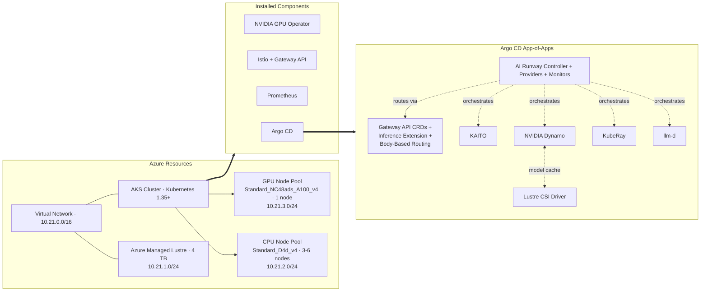

# AKS LLMs: Prototype to Production on AKS

This demo shows how to take an LLM from experiment to production on Azure Kubernetes Service (AKS) with AI Runway.

The goal is to keep the path easy to follow: provision the cluster, connect to it, and then let AI Runway handle model deployment, routing, and operational concerns across multiple inference backends.

## Demo Goal

By the end of this demo, you should understand how to:

- Deploy an LLM on AKS using CPU and GPU node pools.
- Use AI Runway as a single interface for multiple inference backends.
- Add production-style routing, scaling, and monitoring.
- Manage the platform through GitOps with Argo CD.

## What AI Runway Does

AI Runway is an open-source project that treats model deployments as native Kubernetes resources.

In practice, that means you describe what you want to run, and the controller handles the provider-specific work behind the scenes.

### Why Use It

- One interface for multiple providers.
- Less infrastructure work for AI teams.
- Automatic provider and engine selection based on the spec.
- Built-in support for GitOps, monitoring, and scalable deployment patterns.

### Compared With The Traditional Approach

| Without AI Runway | With AI Runway |
| --- | --- |
| Learn each provider's CRDs and configuration separately | Use one `ModelDeployment` CRD across providers |
| Manually match models to the right backend and engine | Let the controller select the backend and engine |
| Configure routing resources for each model by hand | Create gateway resources automatically |
| Track status per provider in different ways | Use unified status conditions and Prometheus metrics |
| Write provider-specific YAML for every deployment | Describe the desired outcome and let the controller handle the rest |

> [!NOTE]
> AI Runway does not replace inference providers. It sits above them and gives you one consistent interface.

## Prerequisites

Make sure these tools are available before you start the demo:

| Tool | Purpose |
| --- | --- |
| [Azure CLI](https://learn.microsoft.com/cli/azure/install-azure-cli) | Manage Azure resources and AKS credentials |
| [kubectl](https://kubernetes.io/docs/tasks/tools/) | Work with the Kubernetes cluster |
| [Bun](https://bun.sh) | Run the AI Runway dashboard |
| [Helm](https://helm.sh/docs/intro/install/) | Install supporting components |
| [jq](https://jqlang.org/) | Parse JSON output from `kubectl` and `curl` |
| [yq](https://github.com/mikefarah/yq) | Parse YAML output from `kubectl` |
| [Git](https://git-scm.com/) | Clone and manage the repository |
| [Argo CD CLI](https://argo-cd.readthedocs.io/en/stable/cli_installation/) | Optional GitOps checks |
| [GitHub Copilot CLI](https://github.com/features/copilot/cli/) | Optional terminal assistant, version 1.0.44 or later |
| [Visual Studio Code](https://code.visualstudio.com/download) | Recommended editor, version 1.120.0 or later |

## Provision The Infrastructure

This repository includes Terraform that provisions the demo environment.

Start with Azure authentication:

```bash
az login
```

Then move into the infrastructure folder and apply the configuration:

```bash
cd src/infra
terraform init
terraform apply
```

This creates:

- A resource group.
- An AKS cluster with CPU and GPU node pools.
- Azure Managed Lustre storage.
- The application platform bootstrap through Argo CD.

## High-Level Architecture



## Connect To The Cluster

After Terraform finishes, capture the outputs and request credentials:

```bash
RG_NAME=$(terraform output -raw rg_name)
AKS_NAME=$(terraform output -raw aks_cluster_name)

az aks get-credentials \
  --resource-group $RG_NAME \
  --name $AKS_NAME \
  --overwrite
```

> [!NOTE]
> This demo requires Azure quota for the GPU VM SKU `Standard_NC48ads_A100_v4`. Request quota increases early, because approval can take time.

Verify that the cluster connection works:

```bash
kubectl cluster-info
```

If everything is wired up correctly, you should see the Kubernetes control plane and CoreDNS endpoints.

## How The Demo Is Organized

Think of the demo in two layers:

1. Terraform builds the base Azure and AKS environment.
2. Argo CD applies the app-of-apps pattern and installs the AI Runway stack plus its supporting components.

That means the infrastructure is created first, then the Kubernetes workloads are layered on top during cluster provisioning.

## Notes On The Manifests

The manifests in this demo are managed by Argo CD using an app-of-apps pattern.

The root application bootstraps the child applications for AI Runway, KAITO, Dynamo, Gateway API, KubeRay, and the Lustre CSI driver. Those workloads are applied automatically during cluster provisioning, and the workshop modules reference the individual manifests when you need to make changes.

## Demo Summary

This lab is about showing the full path from prototype to production for LLMs on AKS.

The important takeaway is that AI Runway gives you a single Kubernetes-native control plane for model deployment, while AKS, Terraform, and Argo CD handle the underlying platform and delivery workflow.
