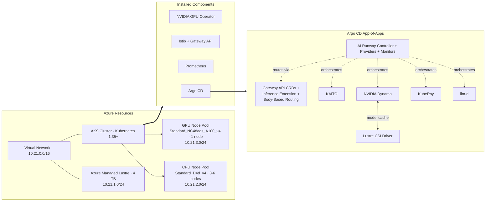
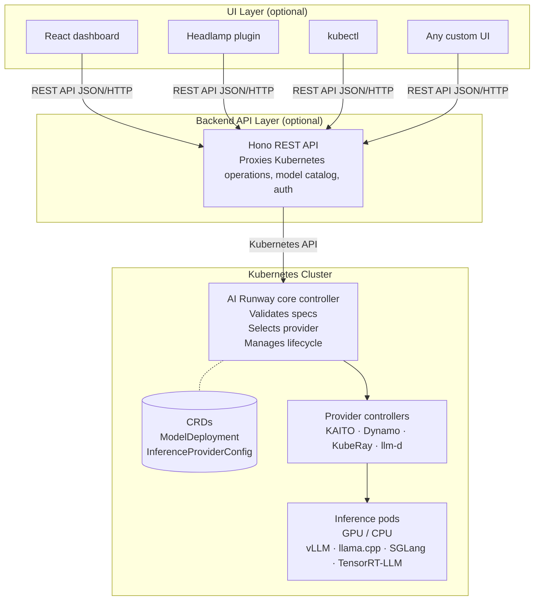
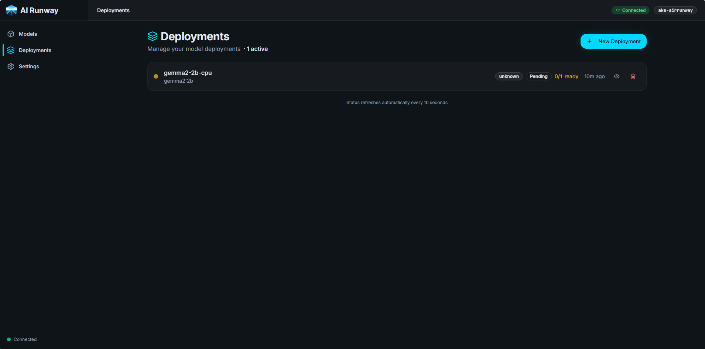
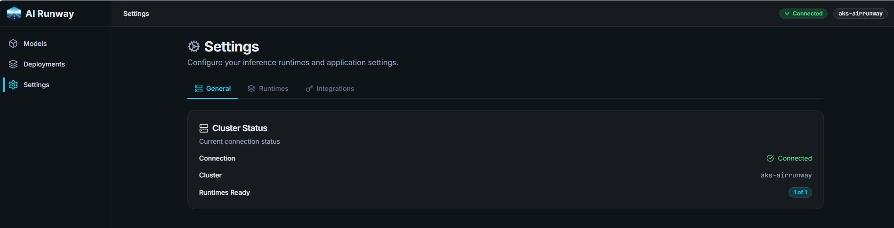
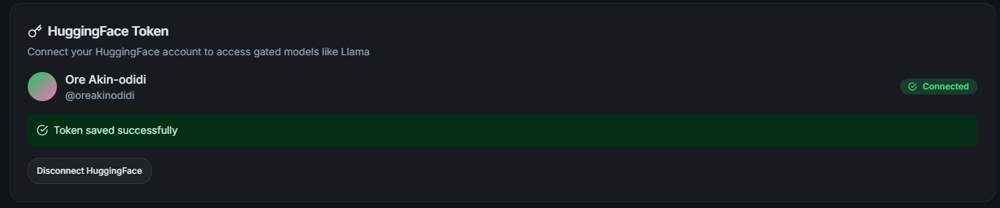
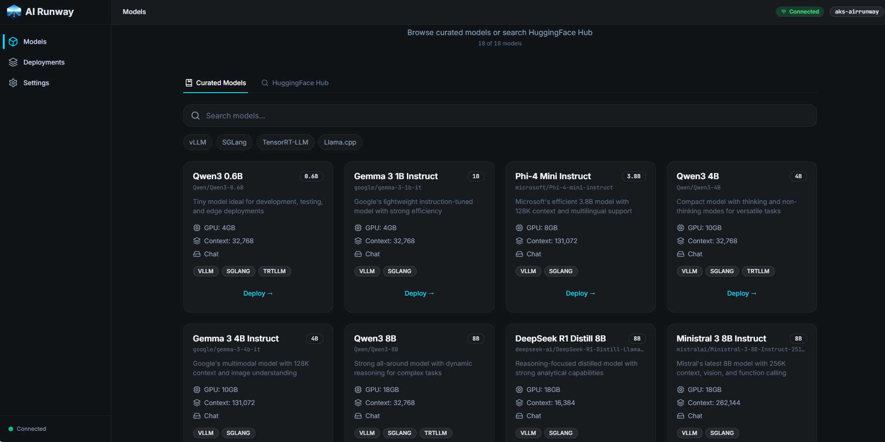

# AKS LLMs: Prototype to Production on AKS

This demo shows how to take an LLM from experiment to production on Azure Kubernetes Service (AKS) with AI Runway.

The goal is to keep the path easy to follow: provision the cluster, connect to it, and then let AI Runway handle model deployment, routing, and operational concerns across multiple inference backends.

## Demo Goal

By the end of this demo, you should understand how to:

- Deploy an LLM on AKS using CPU and GPU node pools.
- Use AI Runway as a single interface for multiple inference backends.
- Add production-style routing, scaling, and monitoring.
- Manage the platform through GitOps with Argo CD.

## What AI Runway Does

AI Runway is an open-source project that treats model deployments as native Kubernetes resources.

In practice, that means you describe what you want to run, and the controller handles the provider-specific work behind the scenes.

### Why Use It

- One interface for multiple providers.
- Less infrastructure work for AI teams.
- Automatic provider and engine selection based on the spec.
- Built-in support for GitOps, monitoring, and scalable deployment patterns.

### Compared With The Traditional Approach

| Without AI Runway                                       | With AI Runway                                                      |
| ------------------------------------------------------- | ------------------------------------------------------------------- |
| Learn each provider's CRDs and configuration separately | Use one`ModelDeployment` CRD across providers                     |
| Manually match models to the right backend and engine   | Let the controller select the backend and engine                    |
| Configure routing resources for each model by hand      | Create gateway resources automatically                              |
| Track status per provider in different ways             | Use unified status conditions and Prometheus metrics                |
| Write provider-specific YAML for every deployment       | Describe the desired outcome and let the controller handle the rest |

> [!NOTE]
> AI Runway does not replace inference providers. It sits above them and gives you one consistent interface.

## Prerequisites

Make sure these tools are available before you start the demo:

| Tool                                                                     | Purpose                                              |
| ------------------------------------------------------------------------ | ---------------------------------------------------- |
| [Azure CLI](https://learn.microsoft.com/cli/azure/install-azure-cli)      | Manage Azure resources and AKS credentials           |
| [kubectl](https://kubernetes.io/docs/tasks/tools/)                        | Work with the Kubernetes cluster                     |
| [Bun](https://bun.sh)                                                     | Run the AI Runway dashboard                          |
| [Helm](https://helm.sh/docs/intro/install/)                               | Install supporting components                        |
| [jq](https://jqlang.org/)                                                 | Parse JSON output from`kubectl` and `curl`       |
| [yq](https://github.com/mikefarah/yq)                                     | Parse YAML output from`kubectl`                    |
| [Git](https://git-scm.com/)                                               | Clone and manage the repository                      |
| [Argo CD CLI](https://argo-cd.readthedocs.io/en/stable/cli_installation/) | Optional GitOps checks                               |
| [GitHub Copilot CLI](https://github.com/features/copilot/cli/)            | Optional terminal assistant, version 1.0.44 or later |
| [Visual Studio Code](https://code.visualstudio.com/download)              | Recommended editor, version 1.120.0 or later         |

## Provision The Infrastructure

This repository includes Terraform that provisions the demo environment.

Start with Azure authentication:

```bash
az login
```

Then move into the infrastructure folder and apply the configuration:

```bash
cd src/infra
terraform init
terraform apply
```

This creates:

- A resource group.
- An AKS cluster with CPU and GPU node pools.
- Azure Managed Lustre storage.
- The application platform bootstrap through Argo CD.

## High-Level Architecture


```mermaid
graph LR
    subgraph Azure["Azure Resources"]
        VNet["Virtual Network · 10.21.0.0/16"]
        AKS["AKS Cluster · Kubernetes 1.35+"]
        Lustre["Azure Managed Lustre · 4 TB<br/>10.21.1.0/24"]
        GPUNodePool["GPU Node Pool<br/>Standard_NC48ads_A100_v4 · 1 node<br/>10.21.3.0/24"]
        CPUNodePool["CPU Node Pool<br/>Standard_D4d_v4 · 3-6 nodes<br/>10.21.2.0/24"]
    end

    subgraph Installed["Installed Components"]
        GPU["NVIDIA GPU Operator"]
        Istio["Istio + Gateway API"]
        Prometheus["Prometheus"]
        ArgoCD["Argo CD"]
    end

    subgraph Apps["Argo CD App-of-Apps"]
        Gateway["Gateway API CRDs +<br/>Inference Extension +<br/>Body-Based Routing"]
        AIRunway["AI Runway Controller + Providers + Monitors"]
        KAITO["KAITO"]
        Dynamo["NVIDIA Dynamo"]
        LLMd["llm-d"]
        LustreCSI["Lustre CSI Driver"]
        KubeRay["KubeRay"]
    end

    VNet --- AKS
    VNet --- Lustre
    AKS --> CPUNodePool
    AKS --> GPUNodePool

    AKS ==> Installed
    ArgoCD ==> Apps

    AIRunway -.->|orchestrates| KAITO
    AIRunway -.->|orchestrates| Dynamo
    AIRunway -.->|orchestrates| KubeRay
    AIRunway -.->|orchestrates| LLMd
    AIRunway -.->|routes via| Gateway
    Dynamo <-.->|model cache| LustreCSI
```

## Connect To The Cluster

After Terraform finishes, capture the outputs and request credentials:

```bash
RG_NAME=$(terraform output -raw rg_name)
AKS_NAME=$(terraform output -raw aks_cluster_name)

az aks get-credentials \
  --resource-group $RG_NAME \
  --name $AKS_NAME \
  --overwrite-existing
```

> [!NOTE]
> This demo requires Azure quota for the GPU VM SKU `Standard_NC48ads_A100_v4`. Request quota increases early, because approval can take time.

Verify that the cluster connection works:

```bash
kubectl cluster-info
```

If everything is wired up correctly, you should see the Kubernetes control plane and CoreDNS endpoints.

## How The Demo Is Organized

Think of the demo in two layers:

1. Terraform builds the base Azure and AKS environment.
2. Argo CD applies the app-of-apps pattern and installs the AI Runway stack plus its supporting components.

That means the infrastructure is created first, then the Kubernetes workloads are layered on top during cluster provisioning.

## Notes On The Manifests

The manifests in this demo are managed by Argo CD using an app-of-apps pattern.

The root application bootstraps the child applications for AI Runway, KAITO, Dynamo, Gateway API, KubeRay, and the Lustre CSI driver. Those workloads are applied automatically during cluster provisioning, and the demos reference the individual manifests when you need to make changes.

## Demo Summary

This demo walks the full path from prototype to production for LLMs on AKS.

The important takeaway is that AI Runway gives you a single Kubernetes-native control plane for model deployment, while AKS, Terraform, and Argo CD handle the underlying platform and delivery workflow.

## Demo 1: Deployment & Core Concepts

In this demo, I will show you how to:

- Deploy your first **ModelDeployment** from a manifest.
- See how AI Runway separates what you want to run from how it gets run.
- Identify the purpose of the **ModelDeployment** and **InferenceProviderConfig** CRDs.
- Read deployment status conditions so you can see what the controller is doing.

Start by creating your first AI Runway `ModelDeployment` resource. This manifest deploys a small CPU-based Gemma2 model. It intentionally leaves out the provider and engine so AI Runway can choose them automatically.

```bash
kubectl apply -f C:\AKS_LABS\AKS_AI_and_LLM\AI_Runway\demo_yaml\cpumodel.yaml
```

Expected output:

```text
modeldeployment.airunway.ai/gemma2-2b-cpu created
```

> [!NOTE]
> This manifest includes `spec.image` because CPU-based models need a pre-built model server image. GPU-based models do not need this field because the provider handles image selection.

Confirm that the resource exists:

```bash
kubectl get modeldeployment gemma2-2b-cpu
```

The deployment may not be ready yet. That is expected, because the controller is still working through its startup lifecycle.

### How AI Runway works

- AI Runway separates your **intent** from the **implementation**.
- Your intent is the model, engine, and resources you want.
- The implementation is the backend that actually runs it, plus the setup it needs.
- You describe what you want in a `ModelDeployment`, and the controller handles provider selection, resource creation, and gateway routing.

> [!NOTE]
> Think of it like a universal remote: the `ModelDeployment` is the remote, and the provider is the device behind the TV that actually does the work.

In simple terms, a provider is the part of the system that actually hosts and serves the model. AI Runway picks the right provider based on your deployment spec, so you do not need to manage each backend manually.

The resource you just created is a good example of this separation. One Kubernetes object captures your full deployment intent, while the provider handles the actual work behind the scenes. The available providers in this demo are KAITO, NVIDIA Dynamo, KubeRay, and llm-d — and the controller chose one for you automatically.

### Architecture Overview

AI Runway is split into three layers: the Kubernetes cluster, an optional backend API, and an optional UI.


```mermaid
graph TD
    subgraph UI["UI Layer (optional)"]
        ReactUI[React dashboard]
        Headlamp[Headlamp plugin]
        Kubectl[kubectl]
        CustomUI[Any custom UI]
    end

    subgraph Backend["Backend API Layer (optional)"]
        Hono[Hono REST API<br/>Proxies Kubernetes operations, model catalog, auth]
    end

    subgraph Cluster["Kubernetes Cluster"]
        Core[AI Runway core controller<br/>Validates specs<br/>Selects provider<br/>Manages lifecycle]
        CRDs[(CRDs<br/>ModelDeployment<br/>InferenceProviderConfig)]
        Providers[Provider controllers<br/>KAITO · Dynamo · KubeRay · llm-d]
        Pods[Inference pods<br/>GPU / CPU<br/>vLLM · llama.cpp · SGLang · TensorRT-LLM]
    end

    ReactUI & Headlamp & Kubectl & CustomUI -->|REST API JSON/HTTP| Hono
    Hono -->|Kubernetes API| Core
    Core --> Providers
    Providers --> Pods
    Core -.- CRDs
```

#### Key Design Points

| Principle                            | What it means                                                                                       |
| ------------------------------------ | --------------------------------------------------------------------------------------------------- |
| Core controller is minimal           | It validates specs, selects providers, manages routing, and updates status.                         |
| Provider controllers are out-of-tree | Each provider has its own controller, so it can be versioned and released independently.            |
| UI is optional                       | You can use kubectl and CRDs directly; the web UI is only a convenience layer.                      |
| Two-tier reconciliation              | The core defines the interface, and providers implement it, similar to how CRI works in Kubernetes. |

> [!NOTE]
> Just like the kubelet talks to containerd through CRI and does not care whether you use containerd or CRI-O, the AI Runway core controller talks to providers through a standard interface. You can swap providers without changing your `ModelDeployment` specs.

### The ModelDeployment CRD

`ModelDeployment` is the main resource you work with in this demo. You describe what model you want and what resources it needs.

The Gemma deployment you just applied asked for a Gemma2 2B model with 1 CPU. AI Runway handled the rest: it found a provider that supports CPU workloads, selected an engine, created the Kubernetes resources, and started managing the lifecycle.

### Providers: The Inference Backends

A provider is the backend that runs your model. Each one has different strengths, and AI Runway selects the right one automatically based on what your deployment spec requires.

Examples in this demo include:

- **KAITO** (CNCF Sandbox): LLM inference, fine-tuning, and RAG on Kubernetes with GPU auto-provisioning and support for vLLM-compatible Hugging Face models.
- **Dynamo** (NVIDIA): Distributed inference with disaggregated serving, smart KV cache routing, and dynamic GPU scheduling.
- **KubeRay**: Kubernetes operator for Ray workloads such as RayCluster, RayJob, and RayService.
- **llm-d** (CNCF Sandbox): Kubernetes-native distributed inference with LLM-aware routing, KV cache management, and multi-hardware support.

You do not need to learn every provider's configuration format. You describe the outcome you want, and the controller chooses the provider that fits.

### The InferenceProviderConfig CRD

Each provider registers itself with the cluster through an `InferenceProviderConfig`. This tells AI Runway what the provider can do, including which engines it supports, whether it handles CPU or GPU workloads, and which serving modes it offers.

Check the registered providers:

```bash
kubectl get inferenceproviderconfigs
```

Expected output:

```text
NAME      READY   VERSION                   AGE
dynamo    true    dynamo-provider:v0.2.0    1h
kaito     true    kaito-provider:v0.1.0     1h
kuberay   true    kuberay-provider:v0.1.0   1h
llmd      true    llmd-provider:v0.1.0      1h
```

You should see all four providers with `READY=true`. That confirms the controller knows which runtimes are available and healthy.

To inspect a provider in more detail, run:

```bash
kubectl get inferenceproviderconfig kaito -o yaml
```

Expected output, with metadata removed for brevity:

```yaml
spec:
  capabilities:
    cpuSupport: true
    engines:
      - vllm
      - llamacpp
    gpuSupport: true
    servingModes:
      - aggregated
  selectionRules:
    - condition: "!has(spec.resources.gpu) || spec.resources.gpu.count == 0"
      priority: 100
    - condition: spec.engine.type == 'llamacpp'
      priority: 100
status:
  ready: true
  version: kaito-provider:v0.1.0
```

> [!NOTE]
> The two parts to pay attention to are `spec.capabilities`, which tells you what the provider supports, and `selectionRules`, which tells you when it gets auto-selected. Because this demo asks for CPU, the controller should pick KAITO with the llama.cpp engine.

### Watch The Deployment Status

Now check what the controller decided for the Gemma deployment:

```bash
kubectl get modeldeployment gemma2-2b-cpu -o yaml | yq '.status'
```

You should see conditions similar to these:

```yaml
conditions:
  - message: Engine llamacpp auto-selected from provider kaito
    status: "True"
    type: EngineSelected
  - message: Provider kaito auto-selected
    status: "True"
    type: ProviderSelected
  - message: Workspace created successfully
    status: "True"
    type: ResourceCreated
  - message: All replicas are ready
    status: "True"
    type: Ready
  - message: InferencePool and HTTPRoute created
    status: "True"
    type: GatewayReady
engine:
  type: llamacpp
phase: Running
provider:
  name: kaito
  resourceKind: Workspace
  selectedReason: "matched capabilities: engine=llamacpp, gpu=false, mode=aggregated"
replicas:
  available: 1
  desired: 1
  ready: 1
```

> [!TIP]
> Read `status.conditions` from top to bottom. They tell the story of the deployment: validation, provider selection, resource creation, readiness, and gateway setup. If traffic is not flowing, this is the first place to check.

### Test The Model Endpoint

The model exposes an OpenAI-compatible API. For this demo, use `kubectl port-forward` to test it directly.

In a new terminal tab, start a port-forward to the KAITO workspace service:

```bash
kubectl port-forward svc/gemma2-2b-cpu 8080:80
```

In another terminal tab, send a chat request:

```bash
curl -s http://localhost:8080/v1/chat/completions \
  -H "Content-Type: application/json" \
  -d '{
    "model": "gemma-2-2b-instruct",
    "messages": [{"role": "user", "content": "What are the advantages and disadvantages of running models on Kubernetes?"}],
    "max_tokens": 50
  }' | jq
```

You should see a JSON response with the model reply. That confirms the model is running and serving an OpenAI-compatible API.

> [!NOTE]
> Later in the demo, you will see how the Gateway API Inference Extension routes traffic to multiple models through a single shared endpoint.

When you are done, press **Ctrl+C** in the port-forward terminal to stop it. You can close the extra terminal tab.

## Demo 2: Cluster Verification and Dashboard

This demo shows you how to launch the AI Runway dashboard and inspect your live deployment. You will also verify that the AKS cluster has GPU resources available and confirm that the inference gateway and AI Runway components are healthy.


### AI Runway Dashboard

The AI Runway dashboard gives teams a visual overview of available models, cluster health, and deployment status. It is useful during onboarding and incident triage when you need a quick snapshot of the environment without running kubectl. It is optional — you can run it locally during development or deploy it into the cluster for shared team access.

To run locally:

```bash
cd ~ && git clone --branch v0.6.0 https://github.com/kaito-project/airunway.git
cd airunway
```

Start the dashboard

```bash
powershell -c "irm bun.sh/install.ps1 | iex"

bun install
```

> [!NOTE]
> Bun on Windows does not yet support `&` for parallel background processes, so run the backend and frontend in two separate terminals.

**Terminal 1 – Backend (port 3001):**

```bash
bun run --filter '@airunway/backend' dev
```

**Terminal 2 – Frontend (port 5173):**

```bash
bun run --filter '@airunway/frontend' dev
```

This launches both the frontend and backend. The backend API runs on port 3001 and the frontend UI runs on port 5173. Open `http://localhost:5173` in your browser.

### See Your Deployment in the Dashboard

Open the **Deployments** page in the left sidebar. You should see **gemma2-2b-cpu** from Demo 1 listed with its phase and readiness status. Each row shows the deployment name, phase (Pending, Deploying, Running, Failed), provider, engine, replica counts, and age.



Click **gemma2-2b-cpu** to open the deployment details. This will show the runtime (KAITO), engine (LLAMACPP), model name, gateway endpoint, an example curl command, metrics, and logs. This is the same information queried with `kubectl get modeldeployment -o yaml`, presented visually.

### Settings Page

Click **Settings** in the left sidebar. The Settings page has three tabs that give a full picture of your cluster's readiness.

**General** shows cluster connectivity and a runtime summary. Confirm it shows **Connected** to your AKS cluster with **4 of 4** runtimes installed.

**Runtimes** gives a full view of each provider's installation status, capabilities (engines, serving modes, hardware support), and version. It also shows prerequisite checks (GPU Operator, Gateway API CRDs) and cluster autoscaling status. This is the place to confirm your cluster's inference stack is complete. If a provider shows as not installed, the auto-selection algorithm will skip it when matching deployments.



**Integrations** shows the status of external services like GPU Operator health, Gateway API CRDs, and Hugging Face OAuth. If you already have a Hugging Face account, click **Connect Hugging Face** and follow the OAuth flow. Once connected, you'll see your Hugging Face username and a **Connected** badge.



### Browse the Model Catalog

Click **Models** in the left sidebar. This page is a catalog of models organized by engine compatibility. Each card shows the model name, parameter count, required GPU memory, and supported inference engines (vLLM, SGLang, TensorRT-LLM, llama.cpp). The **Deploy →** button on each card opens a guided deployment flow where you pick a runtime, engine, and resource allocation. In this demo, we use kubectl manifests directly so you can see auto-selection at work.



### Quick Cluster Health Check

Now let's verify the cluster itself using the CLI. Open a new terminal tab and run the following command to confirm your cluster has the right node pools and GPU resources:

```bash
kubectl get nodes -o wide
```

You should see at least 3 nodes with **default** in the name (CPU pool) and 1 node with **inference** in the name (GPU pool). The exact count depends on the Terraform configuration you applied.

> [!TIP]
> Skip this section if you do not have GPU nodes available on your account.
> 
Check the GPU resources available:

```bash
kubectl get node -l agentpool=inference -o yaml | yq '.items[0].status.allocatable | pick(["cpu", "memory", "nvidia.com/gpu"])'
```

You should see **nvidia.com/gpu: "2"**, confirming 2 NVIDIA GPUs are available.

> [!NOTE]
> A GPU node pool with autoscaling is enabled for this lab. On your own cluster, you'd provision the node pool and choose a VM SKU that fits your workload. See the [AKS docs](https://learn.microsoft.com/azure/aks/use-nvidia-gpu?tabs=add-ubuntu-gpu-node-pool) for details on GPU node pools.

Verify the inference gateway and AI Runway controllers are healthy:

```bash
kubectl get gateway -n istio-system 
kubectl get pods -n airunway-system
```

The gateway should show **PROGRAMMED: True** with an external IP. All controller pods should be **Running**.

> [!NOTE]
> **Gateway API Inference Extension** extends the standard Gateway API for AI/ML workloads. It adds inference-aware routing and load balancing through components like InferencePool, Endpoint Picker Proxy (EPP), Body-Based Router (BBR), and HTTPRoute. AI Runway creates all of these automatically for each ModelDeployment that has gateway enabled. You will see how the routing works in detail in Demo 3.

## Demo 3: GPU Auto-Selection & Validation

This demo shows you how to deploy a GPU model with a minimal manifest. You will see AI Runway auto-select Dynamo and vLLM, compare GPU versus CPU inference speed, and understand how the gateway routes requests across models. Demo 1 covered the CPU path — this builds on that and shows how the same pattern applies to a GPU workload.

### Deploy a Small GPU Model

```bash
kubectl apply -f C:\AKS_LABS\AKS_AI_and_LLM\AI_Runway\manifests\smallgpumodel.yaml
```

The only difference from the CPU manifest is `spec.resources.gpu.count: 1`. That single field tells the controller this is a GPU workload, so it auto-selects **Dynamo** as the provider and **vLLM** as the engine.

> [!TIP]
> This **0.6B** model is intentionally small to keep deployment times short during the demo.