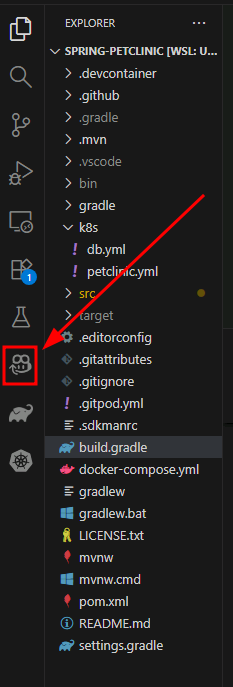
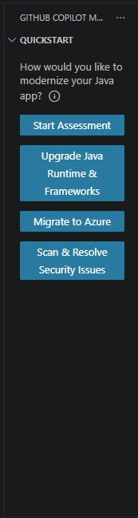
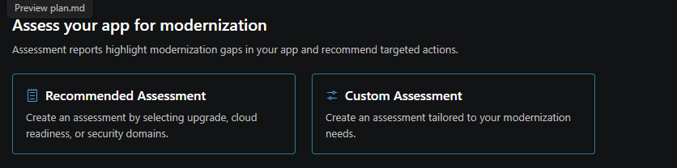
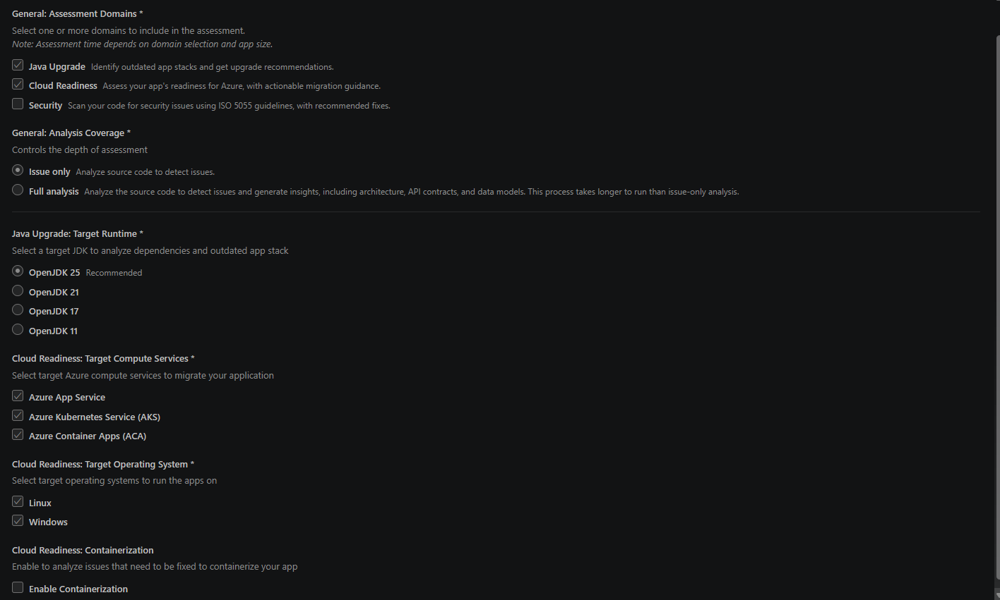
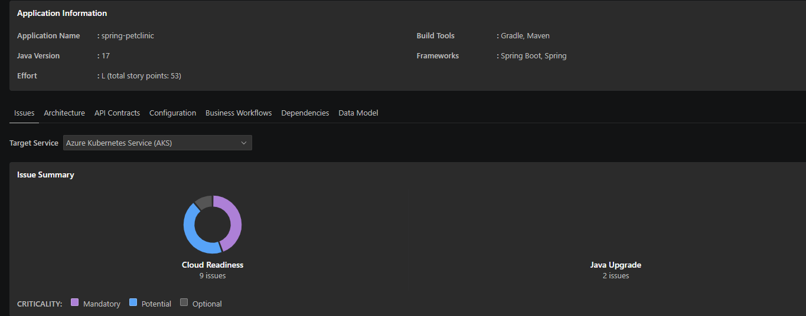

# Migrate to AKS Automatic with GitHub Copilot Modernization

## Workshop Overview

### Learning Objectives

By the end of this workshop, you will be able to:

- Run [Spring Boot PetClinic](https://github.com/spring-projects/spring-petclinic) locally with PostgreSQL and basic authentication.
- Modernize the codebase using [GitHub Copilot modernization](https://marketplace.visualstudio.com/items?itemName=vscjava.migrate-java-to-azure).
- Migrate the database to [Azure PostgreSQL Flexible Server](https://learn.microsoft.com/azure/postgresql/flexible-server/) integrated with [Microsoft Entra ID](https://learn.microsoft.com/en-us/azure/active-directory/).
- Containerize the app using [Containerization Assist MCP Server](https://github.com/Azure/containerization-assist).
- Deploy to [AKS Automatic](https://learn.microsoft.com/en-us/azure/aks/intro-aks-automatic) using [Workload Identity](https://learn.microsoft.com/en-us/azure/aks/workload-identity-overview) and [Service Connector](https://learn.microsoft.com/en-us/azure/service-connector/).

---

### Prerequisites

Your virtual machine already includes all required tools:

- [Azure CLI](https://learn.microsoft.com/en-us/cli/azure/install-azure-cli)
- [Java 17 or 21](https://learn.microsoft.com/en-us/java/openjdk/download) (Microsoft OpenJDK)
- [Maven 3.8+](https://maven.apache.org/install.html)
- [Docker Desktop](https://www.docker.com/)
- [Visual Studio Code](https://code.visualstudio.com/) with:
  - Java Extension Pack
  - GitHub Copilot Modernization Extension Pack
- [kubectl](https://learn.microsoft.com/en-us/azure/aks/learn/quick-kubernetes-deploy-cli#install-the-azure-cli-and-kubernetes-cli)
- Windows Terminal with Bash (WSL)
- Git

---

## Setting Up the Lab

### Sign In to Azure

1. Open Microsoft Edge and sign in to Azure using the credentials in the **Resources** tab.

1. Next, sign in from a terminal using Azure CLI:

    ```bash
    az login
    ```

1. Press **CTRL** and select the URL shown in the terminal. This opens a new tab in Edge.

1. Pick your user account to complete sign-in.

1. Back in the terminal, press **Enter** to use the current subscription.

---

### Install the Service Connector Extension

1. Install the Service Connector extension:

    ```bash
    az extension add --name serviceconnector-passwordless --upgrade
    ```

1. Before you create the service connector, collect the required resource IDs. Run each command and keep the outputs for the next step:

    ```bash
    # Get the AKS cluster resource ID
    az aks show --resource-group <RESOURCE_GROUP> --name <AKS_CLUSTER_NAME> --query id -o tsv

    # Get the PostgreSQL database resource ID
    az postgres flexible-server db show --resource-group <RESOURCE_GROUP> --server-name <PG_SERVER_NAME> --database-name <DB_NAME> --query id -o tsv

    # Get the user-assigned managed identity resource ID
    az identity show --resource-group <RESOURCE_GROUP> --name <IDENTITY_NAME> --query id -o tsv
    ```

1. Replace the placeholders with the values from the previous step, then create the service connector:

    ```bash
    nohup bash -c 'az aks connection create postgres-flexible \
      --connection pg \
      --source-id <AKS_CLUSTER_ID> \
      --target-id <POSTGRES_DATABASE_ID> \
      --workload-identity <USER_ASSIGNED_IDENTITY_ID> \
      --client-type none \
      --kube-namespace default | tee ~/spring-petclinic/k8s/sc.json' \
      > ~/spring-petclinic/k8s/sc.log 2>&1 &
    ```

    > [!NOTE]
    > This command usually takes about 8 minutes. You can leave it running and open a new terminal tab using the **+** icon in Windows Terminal while you continue.

---

### Configure Azure RBAC Authentication for kubectl

Before you deploy to AKS, configure **kubectl** to use Azure RBAC authentication.

1. Look up your signed-in user principal name:

    ```bash
    az ad signed-in-user show --query userPrincipalName -o tsv
    ```

1. Confirm your resource group name and AKS cluster name:

    ```bash
    az aks list --query "[].{Name:name, RG:resourceGroup}" -o table
    ```

1. Get the AKS cluster resource ID:

    ```bash
    az aks show --resource-group <RESOURCE_GROUP_NAME> --name <AKS_CLUSTER_NAME> --query id -o tsv
    ```

1. Assign yourself the Cluster Admin role:

    ```bash
    az role assignment create \
      --assignee <USER_EMAIL_OR_OBJECT_ID> \
      --role "Azure Kubernetes Service RBAC Cluster Admin" \
      --scope <AKS_CLUSTER_ID>
    ```

1. Download cluster credentials:

    ```bash
    az aks get-credentials --resource-group <RESOURCE_GROUP_NAME> --name <AKS_CLUSTER_NAME>
    ```

1. Configure kubectl to use Azure RBAC (Entra ID) authentication:

    ```bash
    kubelogin convert-kubeconfig --login azurecli
    ```

    > [!NOTE]
    > This configures kubectl to authenticate through Entra ID using Azure RBAC roles assigned to your account. It is required for AKS Automatic clusters with Azure RBAC enabled.

1. Verify access:

    ```bash
    kubectl get nodes
    ```

---

### Authenticate GitHub Copilot

To use GitHub Copilot, sign in with the GitHub account provided in the lab environment.

1. In the browser, open [https://github.com](https://github.com).

1. Select **Sign in** and use the credentials listed in the **Resources** tab.

1. Select **Continue** to complete sign-in.

> [!IMPORTANT]
> This lab uses GitHub Enterprise. Activation is usually quick, but it can take up to 40 minutes for the account to become fully active. If you are redirected back to sign-in, wait a few minutes and try again.

---

### Sign In to VS Code with GitHub

After signing in to GitHub, open VS Code and complete Copilot setup.

1. In a terminal, clone the spring-petclinic repository and open it in VS Code:

    ```bash
    git clone https://github.com/spring-projects/spring-petclinic.git
    cd spring-petclinic
    code .
    ```


1. In VS Code, select the **account icon** in the bottom-left, then select **Sign in to use Copilot**.

1. Select **Continue with GitHub**.

1. Authorize VS Code to access your GitHub account.

1. Select **Connect**, then **Authorize Visual-Studio-Code**.

1. When prompted, choose to always allow **vscode.dev** to open links.

1. Open the **GitHub Copilot Chat** panel and switch the model to **Claude Sonnet 4.6**.

---

> The environment is now configured. Next, you will verify the local PetClinic app and start the migration and modernization flow.

---

## Verify and Explore PetClinic Locally

**What you will do:** Confirm the local PetClinic app is running with PostgreSQL, then explore core features.

**What you will learn:** How to validate a local Spring Boot app connected to Docker-based PostgreSQL and walk through core functionality.

---

### Verify the Application

1. In VS Code, open a new terminal with **Ctrl+`** or **Terminal** → **New Terminal**.

1. Run the PetClinic application:

    ```bash
    mvn clean compile && mvn spring-boot:run \
      -Dspring-boot.run.arguments="--spring.messages.basename=messages/messages \
      --spring.datasource.url=jdbc:postgresql://localhost/petclinic \
      --spring.sql.init.mode=always \
      --spring.sql.init.schema-locations=classpath:db/postgres/schema.sql \
      --spring.sql.init.data-locations=classpath:db/postgres/data.sql \
      --spring.jpa.hibernate.ddl-auto=none"
    ```

    
    ```powershell
    mvn clean compile && mvn spring-boot:run `
  -Dspring-boot.run.arguments="--spring.messages.basename=messages/messages `
  --spring.datasource.url=jdbc:postgresql://localhost/petclinic `
  --spring.sql.init.mode=always `
  --spring.sql.init.schema-locations=classpath:db/postgres/schema.sql `
  --spring.sql.init.data-locations=classpath:db/postgres/data.sql `
  --spring.jpa.hibernate.ddl-auto=none"

  or

  mvn clean compile
    docker compose up -d postgres
    mvn spring-boot:run '-Dspring-boot.run.arguments=--spring.datasource.url=jdbc:postgresql://localhost:5432/petclinic --spring.datasource.username=petclinic --spring.datasource.password=petclinic --spring.sql.init.mode=always --spring.sql.init.schema-locations=classpath:db/postgres/schema.sql --spring.sql.init.data-locations=classpath:db/postgres/data.sql --spring.jpa.hibernate.ddl-auto=none'
  ```


    ## Troubleshooting

    ```powershell
    $env:JAVA_HOME = "C:\Program Files\Java\jdk-17.0.19"
    $env:Path = "$env:JAVA_HOME\bin;" + (($env:Path -split ';' | Where-Object {
    $_ -and ($_ -notmatch 'Common Files\\Oracle\\Java\\javapath') -and ($_ -notmatch 'Oracle\\Java\\javapath')
    }) -join ';')

    mvn -v

    # Find the process using port 8080
    netstat -ano | findstr :8080

    # Kill the process (replace PID with the actual number)
    Stop-Process -Id <PID> -Force
    ```

1. Open your browser and go to http://localhost:8080 to confirm the app is running.

**Explore the PetClinic application:**

Once it is running, test these key features:

- **Find owners:** Select **FIND OWNERS**, leave Last Name blank, and select **Find Owner** to list all 10 owners.
- **View owner details:** Select an owner (for example, Henry Stevens) to review owner and pet details.
- **Edit pet information:** From an owner page, select **Edit Pet** to review or update pet details.
- **Review veterinarians:** Open **VETERINARIANS** to see the 6 vets and their specialties (radiology, surgery, dentistry).

When you finish exploring, stop the app with **Ctrl+C**.

---

## Application Modernization

**What you will do:** Use GitHub Copilot modernization to assess, remediate, and modernize Spring Boot PetClinic for AKS Automatic.

**What you will learn:** How GitHub Copilot modernization works, how to modernize legacy app components, and how the end-to-end workflow fits together.

---

1. Open the **GitHub Copilot modernization** extension.



### Execute the assessment

Now that Copilot is set up, run the assessment tool to analyze Spring Boot PetClinic using the configured analysis parameters.

1. In the extension UI, select **Migrate to Azure** to start modernization.

1. The assessment starts, and GitHub installs the AppCAT CLI for Java in the background. This may take a few minutes. In chat, you can choose to assess the full codebase or only a specific part.

> [!HINT]
> You can continue by selecting the option you want in the **CHAT** pane. A full repo assessment can take a while.

### Overview of the assessment

GitHub Copilot Modernization (AppCAT) consumes the assessment results. AppCAT reviews scan findings and generates targeted recommendations to prepare the application for containerization and migration to Azure.

- **Target Compute Service**: the destination runtime or Azure compute service.
- **Assesment Domains**: the modernization capability you want AppCAT to focus on.
- **Analysis Coverage**: how deep the analysis should run.
- **Target os**: operating system guidance (Windows or Linux). For this lab, you are not focusing on OS-specific guidance.

**Target Compute Service**

| Target | Description   |
|--|--|
| azure-aks | Best practices for deploying an app to Azure Kubernetes Service.|
| azure-appservice | Best practices for deploying an app to Azure App Service. |
| azure-container-apps | Best practices for deploying an app to Azure Container Apps. |


**Target Runtime**

| Runtime | Description |
|--|--|
| openjdk11 | Best practices for migrating to OpenJDK 11. |
| openjdk17 | Best practices for migrating to OpenJDK 17. |
| openjdk21 | Best practices for migrating to OpenJDK 21. |
| openjdk25 | Best practices for migrating to OpenJDK 25. |

**Analysis modes**

| Mode | Description |
|--------|---------|
| issue-only  | analyze source code to only detect issues |
| **source-only** | Fast analysis that examines source code only. |
| **full** | Full analysis: inspects source code and scans dependencies (slower, more thorough). |

> [!TIP]
> **Where you change these options**
>
> You can customize this report by selecting the Custom Assesment tab to change targets and modes. 

> For this lab, AppCAT runs with the following configurations by default:
> 
>
> 
> If you want a broader scan (including dependency checks), change `mode` to `full`, or add/remove entries under `target runtime` to focus recommendations on a specific runtime or Azure compute service.

### Review the assessment results

After the assessment is completeed, you get a success message in GitHub Copilot chat summarizing what was completed:



The assessment analyzes Spring Boot PetClinic migration readiness and identifies the following:

**Key findings**:

- 9 cloud readiness issues requiring attention
- 2 Java upgrade issues 

### Deep-Dive Report Tabs

Beyond the main Issues tab, use the navigation header to analyze different facets of your application:

- Dependencies & Data Model: Inspect external libraries and database connections.
- Configuration & Architecture: Review application configuration properties and architectural patterns.

**Total Effort Estimation & Story Points**:

- The Application Information section at the top includes a total effort field, which gives users an immediate quantifiable metric of the modernization effort.

**Target Service Context**:

- The Target Service dropdown is set to Azure Kubernetes Service (AKS).
- Assessment results and criticality depend on the chosen target deployment environment (e.g., AKS, ACA or Azure App Service).

> [!TIP]
> 
> The other tabs like Architecture, Dependencies, Configuration, and Data Model provide deeper contextual analysis of the codebase.
> But are only populated when you set analysis coverage to full analysis

**Issue prioritization:** Findings are categorized by urgency to guide remediation:

- Mandatory (Purple) - Critical issues that must be addressed before migration.
- Potential (Blue) - Performance and optimization opportunities.
- Optional (Gray) - Nice-to-have improvements that can be addressed later.

This prioritization helps you focus on blockers first, then optimize and improve over time.

### Granular Issue Breakdown: Review specific findings

Each listed issue category displays its own story point weight (e.g., PostgreSQL database found and MySQL database found each carry 5 story points).Users can filter findings by Domain or Criticality to isolate specific areas of concern when working on large projects.

Users should select individual issues in the report to review detailed recommendations. In practice, review all findings and choose the set that aligns with your migration and modernization goals.

> [!NOTE]
> For this lab, focus on one modernization recommendation:

| Aspect | Details |
|--------|---------|
| **Modernization Lab Focus** |  |
| **What was found** |  |
| **Why this matters** |  |
| **Recommended solution** |  |
| **Benefits** |  |

===

### Take action on findings

Based on assessment findings, GitHub Copilot modernization provides two migration action types:

1. **Guided migrations** (the **Run Task** button): fully guided, step-by-step remediation for common migration patterns.

2. **Unguided migrations** (the **Ask Copilot** button): AI assistance with context-aware guidance and code suggestions for complex or custom scenarios.
