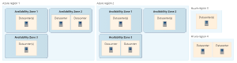
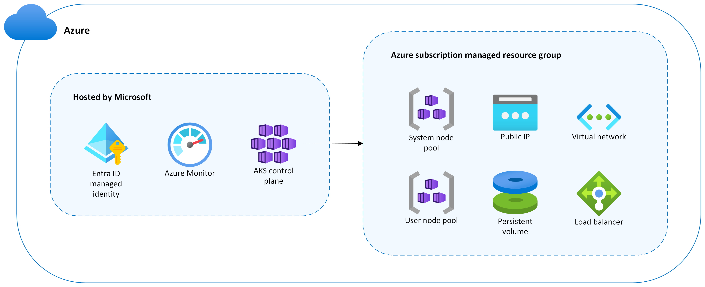
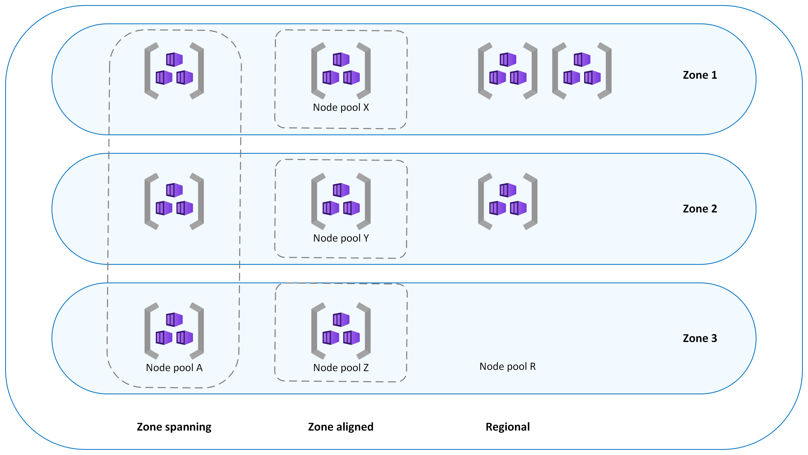

## Contents

| Section | What it covers |
| --- | --- |
| [Introduction](#introduction) | Why resilience planning matters and what these notes cover |
| [Background](#background) | Customer scenario and reason for the engagement |
| [Customer requirements and constraints](#customer-requirements-and-constraints) | Regional dependencies and capacity limitations |
| [Zone-resilient deployment types](#zone-resilient-deployment-types) | Difference between zonal and zone-redundant resources |
| [Availability zones in AKS](#availability-zones-in-azure-kubernetes-service-aks) | Control plane, node pools, pod placement, and traffic distribution |
| [Stateless and stateful applications](#stateless-and-stateful-applications) | Simple explanation of the two workload types |
| [How a two-zone AKS deployment remains resilient](#how-a-two-zone-aks-deployment-remains-resilient) | Capacity impact of a zone failure |
| [Capacity assurance with ODCR](#capacity-assurance-with-odcr) | Guaranteed capacity and commercial considerations |
| [Multi-region deployments](#multi-region-deployments) | Cross-region resilience, disaster recovery, and business continuity |
| [Architecture decision guidance](#architecture-decision-guidance) | Questions to guide the final design |
| [Key takeaways](#key-takeaways) | Main lessons from the discussion |

## Introduction

Resilience is an important part of any application architecture. With the increasing capacity constraints that many customers face, it is important to plan for failure before it occurs. That plan should explain how the application will maintain essential functionality and recover as quickly as possible.

In these notes, I focus specifically on improving regional resilience for Azure Kubernetes Service (AKS) by distributing cluster resources across availability zones. I cover the approaches for creating a zone-resilient AKS cluster, the advantages and tradeoffs of each approach, and the implications of choosing a two-zone design instead of a three-zone design.

> **Key takeaway:** Resilience is not only about preventing failure. It is about designing the application to continue operating and recover when a failure occurs.

## Background

This section gives some background into why this article came about. A customer requested a confidence call about future capacity availability and architectural guidance for a two-zone Azure Kubernetes Service (AKS) deployment. I captured the key points and lessons from the engagement in these notes.

The customer originally required an AKS deployment across three availability zones in the South Central region because of dependencies on existing infrastructure. However, regional capacity constraints and other technical limitations prevented the requested deployment. This led to a broader discussion about two-zone resilience, alternative Azure regions, and the impact of moving the workload to another region.

## Customer requirements and constraints

The engagement highlighted the following requirements and constraints:

* The customer's initial AKS deployment needed to span three availability zones, with a minimum of 16 cores in each zone.
* Existing infrastructure dependencies made South Central the preferred region.
* Current capacity limitations prevented the required three-zone deployment in South Central.
* After the initial deployment, the cluster could scale across only two zones.
    This limitation reflects the capacity currently available in many regions,
    including South Central.
* Moving to another region could provide different capacity options, but the effect on existing infrastructure dependencies would need to be evaluated.

## Availability Zones

An availability zone is a seperate group of datacenters in a region. Key benefits include been close enough to have a fast connection to each other and low latency, but far enough to reduce the chances of all zones been affected by a local issue. Each availability zone has its own power, cooling, and networking systems and if one zone goes down, the other zones can still support regional services, capacity, and high availability. All of this to make sure your data remains accesible and in syn during unexpected events. Important to note not all the Azure regions support availability zones.



## Zone-resilient deployment types

One useful distinction I learned is that Azure resources can provide zone resilience in two ways: **zonal** or **zone-redundant**. The main difference is who manages the distribution, replication, and failover across availability zones.

### Zonal deployments

A zonal resource is pinned to one specific availability zone. The customer is responsible for designing the application to remain available if that zone fails.

* The customer can deploy resources to a specific availability zone of their choice, providing the best performance and low latency
* The customer must distribute application requests across zones and manage data replication between them.
* If one availability zone has an outage, the customer must fail over the application to resources in another zone.
* Zonal resources can be deployed in regions that have only two unconstrained availability zones.
* Infrastructure as a service (IaaS) resources commonly support zonal deployments. A smaller subset of platform as a service (PaaS) resources also supports them.
* Multiple zonal deployments can be placed in different zones and combined to meet higher reliability requirements.

### Zone-redundant deployments

With a zone-redundant resource, Microsoft manages the work required to spread the service across availability zones.

* Microsoft automatically distributes requests and replicates data across multiple availability zones.
* If one availability zone has an outage, Microsoft manages the failover automatically.
* Most PaaS services are designed to support zone-redundant deployments.
* With a few documented exceptions, zone-redundant services require three availability zones to maintain quorum and data consistency.

To find out more about which services support what, you can refer to [Azure services that support availability zones document](https://learn.microsoft.com/en-us/azure/reliability/availability-zones-service-support)

> **Memory line:** With zonal resources, the customer designs and manages cross-zone resilience. With zone-redundant resources, Microsoft manages it as part of the service.

## Availability zones in Azure Kubernetes Service (AKS)

An availability zone is a separate physical location within an Azure region. Each zone contains one or more datacenters with independent power, cooling, and networking. This separation helps protect applications and data from a failure in a single datacenter or zone.

Enabling availability zones in AKS distributes agent nodes across physically separate datacenters within the same region. If one zone fails, nodes in the other zones can continue running. Deploying AKS nodes across multiple zones
does not add an AKS-specific charge, but the application still needs the right pod placement, storage, volume, and load-balancing configuration to benefit from that distribution.

Some workloads also have **co-location requirements**. This means that related resources need to run in the same availability zone. For example, an application might need its pod close to another service to reduce latency, or a pod might need to run in the same zone as the zonal disk it uses. These requirements affect whether customers can spread one node pool across zones or create separate node pools aligned to specific zones.

To solve for these requirments customers can deploy the AKS cluster into a single Availability Zone, ensuring proximity and minimizing internode latency. Or PPG (Proximety placemen Groups) can be used to place nodes in the same data centre for  optimal communication, minimizing latency and maintining zone redundency.

### AKS cluster components



#### Control plane

Microsoft hosts and manages the AKS control plane. This includes the Kubernetes API server, scheduler, and `etcd`. Microsoft replicates these control-plane components across multiple availability zones.

The other cluster resources are deployed into a managed resource group in the customer's Azure subscription. By default, its name begins with `MC_`, which stands for managed cluster.

#### Node pools

AKS node pools are implemented as Virtual Machine Scale Sets. Every AKS cluster requires at least one system node pool, which AKS creates during cluster deployment. This pool hosts critical system pods such as CoreDNS and Metrics Server. Additional user node pools can be added to host application workloads.

I can deploy a node pool in one of three ways:

| Node-pool type | Placement | Main consideration |
| --- | --- | --- |
| Zone-spanning | AKS spreads nodes across all selected zones | Provides distribution without managing a separate pool for each zone |
| Zone-aligned | Each node pool is pinned to one specific zone | Provides granular control over placement, scaling, and zone-level operations |
| Regional | No availability zone is selected | Azure places nodes within the region, but zone distribution is not guaranteed |

##### Choosing a zone-resilient node-pool strategy

There are two main ways customers can arrange AKS worker nodes across availability zones. Both approaches provide zonally resilient worker capacity, but they offer different levels of control.

| Approach | How it works | Best suited for |
| --- | --- | --- |
| One zone-spanning node pool | One node pool contains nodes spread across zones 1, 2, and 3 | Simpler management and general stateless workloads |
| Three zone-aligned node pools | Each node pool is pinned to a different zone | Precise scaling, storage placement, and zone-level control |

With a **zone-spanning node pool**, AKS manages one pool and spreads its nodes across the selected zones. If zone 1 fails, nodes in zones 2 and 3 can continue
running. This option is simpler to manage, but scaling happens at the node-pool level, so customers have less control over which zone receives a new node.

With **three zone-aligned node pools**, customer can create one pool in each zone. For example, one pool is pinned to zone 1, another to zone 2, and another to zone 3. This design gives more control over scaling, pod placement, and zone-specific operations. It is useful when a workload or locally redundant disk must remain in a particular zone. The tradeoff is that you have three node pools to configure, scale, monitor, and maintain.

The node pool layout does not automatically guarantee that pods are evenly distributed. Customers still need to use topology spread constraints or affinity rules
to control pod placement across zones.

Storage also needs to match the node pool strategy:

* Zone-redundant storage (ZRS) disks replicate data across availability zones and provide greater flexibility during a zone failure.
* Locally redundant storage (LRS) disks remain in one zone and can attach only to nodes in that same zone.
* Stateful applications also need a plan for data replication, quorum (Quorum means a majority must remain available and agree before the system can safely continue.), and recovery during a zone failure.

> **Key Takeaway:** A zone spanning pool is simpler to manage. Separate zone aligned pools provide more control over scaling, placement, and zonal storage.



##### Zone-spanning node pools

In a zone-spanning node pool, AKS spreads nodes across all selected zones and balances the number of nodes between them. During a zone outage, nodes in the affected zone might become unavailable, while nodes in the remaining zones continue to operate.

```pwsh
# AKS cluster with a zone-spanning system node pool in all three availability zones with one node in each availability zone
az aks create --resource-group example-rg --name example-cluster --node-count 3 --zones 1 2 3

# Add one new zone-spanning user node pool with two nodes in each availability zone
az aks nodepool add --resource-group example-rg --cluster-name example-cluster --name userpoola --node-count 6 --zones 1 2 3
```

##### Zone-aligned node pools

In a zone-aligned design, each node pool is pinned to a specific availability zone. I can use this approach when the workload needs lower latency between nodes in the same zone, more granular control over scaling, or deliberate cluster-autoscaler behavior for each zone.

```pwsh
# Add three zone-aligned user node pools with two nodes in each zone
az aks nodepool add --resource-group example-rg --cluster-name example-cluster --name userpoolx --node-count 2 --zones 1

az aks nodepool add --resource-group example-rg --cluster-name example-cluster --name userpooly --node-count 2 --zones 2

az aks nodepool add --resource-group example-rg --cluster-name example-cluster --name userpoolz --node-count 2 --zones 3
```

##### Regional node pools

A node pool is regional when I do not set a zone assignment in the deployment template or command. Azure creates regional instances that are not pinned to a specific zone and places them within the region. There is no guarantee that these instances will be evenly spread across zones. They might even be placed in the same zone. As a result, a full zone outage could affect some or all instances in a regional node pool.

### Verify node distribution

I can use `az aks show` with a query to confirm which availability zones are configured for each node pool:

```pwsh
az aks show --name example-cluster --resource-group example-rg --query agentPoolProfiles[].availabilityZones --output tsv
```

I can then use `kubectl get nodes` to see the region and zone assigned to each node. The second command shows which node is hosting each pod:

```pwsh
kubectl get nodes -o custom-columns='NAME:metadata.name, REGION:metadata.labels.topology\.kubernetes\.io/region, ZONE:metadata.labels.topology\.kubernetes\.io/zone'
kubectl describe pod | grep -e "^Name:" -e "^Node:"
```

### Distribute pods across zones

Spreading nodes across zones does not automatically guarantee that application pods are evenly distributed. I can use Kubernetes topology spread constraints to tell the scheduler how to place pod replicas across the available zones.

The `topologyKey: topology.kubernetes.io/zone` setting tells Kubernetes to use the node's availability-zone label as the placement boundary. The `maxSkew: 1` setting controls how unevenly pods can be distributed between those zones.

For example, with three available zones, three replicas, sufficient node capacity, and an appropriate scheduling constraint, a maximum skew of `1` helps place at least one replica in each zone.

### Distribute inbound traffic

AKS deploys an Azure Standard Load Balancer by default. It distributes inbound traffic to healthy backend nodes across the region. If a node becomes unavailable, the load balancer stops directing new traffic to that node and routes traffic to healthy nodes instead.

> **Key Takeaway** Availability zones spread the infrastructure, but I still need to design node pools, pod placement, storage, and traffic routing so the application can survive a zone failure.

## Stateless and stateful applications

In simple terms, the difference is whether the application needs to remember information locally between requests:

* A **stateless application** does not depend on information stored inside a
     specific application instance or pod. Each request can be handled
     independently by any available pod. If one pod fails, another pod can take
     over without needing to recover information from the failed pod.
* A **stateful application** needs to preserve information between requests or
     depends on a stable identity, ordered processing, or persistent storage. If
     its pod fails, the replacement might need to reconnect to its storage,
     recover data, or rejoin the other application replicas before it can serve
     traffic safely.

| Characteristic | Stateless application | Stateful application |
| --- | --- | --- |
| Simple analogy | A receptionist who can handle the next request without knowing the previous conversation | A personal account manager who must retain the customer's history |
| Common examples | Web front ends, REST APIs, and request-processing services | Databases, message brokers, and applications that store local session data |
| Where data is kept | In an external service, such as a database, distributed cache, or object store | In persistent storage or replicated state managed by the application |
| If a pod fails | Another pod can usually serve the next request immediately | A replacement might need to restore data, attach storage, or rejoin a replica group |
| Scaling | Usually straightforward because any replica can handle a request | Requires care to preserve data consistency, identity, and replica membership |
| Zone outage concern | Enough healthy pods and compute capacity must remain in the surviving zone | Data replicas, storage availability, quorum, and recovery behavior must also survive |

> **Memory line:** Stateless applications can replace a pod and continue;
> stateful applications must also preserve and recover what the pod knows.

For stateless applications, a two-zone design is a supported resilient architecture when the application can absorb the capacity reduction through one or more of the following measures:

* Autoscaling
* Load shedding
* Deliberate overprovisioning

Stateful workloads need additional consideration. Workloads that require quorum might still need a three-zone design or additional multi-region protections to meet their availability and recovery requirements.

## How a two-zone AKS deployment remains resilient

> [!NOTE]
> A two-zone AKS deployment remains resilient to a single-zone outage because
> AKS can distribute node pools across both zones and continue serving
> workloads from the surviving zone.

The capacity impact of a zone failure differs between two-zone and three-zone
designs:

| Design      | Approximate capacity lost during one zone failure | Approximate capacity remaining |
|-------------|---------------------------------------------------|--------------------------------|
| Two zones   | 50%                                               | 50%                            |
| Three zones | 33%                                               | 67%                            |

## Capacity assurance with ODCR

On-demand capacity reservation (ODCR) was discussed as an alternative for guaranteeing AKS compute capacity. It is the only guaranteed method of reserving capacity in Azure and is suitable for workloads that run 24 hours a day, seven days a week.

An ODCR can be configured in the Azure portal by creating a capacity reservation group. The following commercial considerations apply:

* ODCR does not increase the per-unit price of the reserved compute capacity.
* Azure charges for the reserved capacity whether or not the workload uses it.
* Future capacity reservation options with minimum usage periods are being piloted.

Before choosing ODCR, it is important to establish the customer's actual capacity requirements. Quota approvals are region-based and must be managed carefully while supply remains constrained.

## Multi-region deployments

Another option I learned to consider is deploying the application across multiple Azure regions. A multi-region architecture can achieve many of the same goals as a multi-zone design, including high availability, resilience, and greater scalability. However, it protects against a broader failure scope because the application is not dependent on a single Azure region.

A multi-region deployment can be used in two ways:

* It can provide an alternative when the preferred region cannot support the required in-region, multi-zone architecture.
* It can complement an existing multi-zone deployment by adding another layer of protection outside the primary region.

For critical workloads, the second region can provide more options for disaster recovery and business continuity. If the primary region becomes unavailable, traffic and operations can fail over to the secondary region, provided the application, data, networking, and dependent services have been designed for cross-region recovery.

For this reason, customers should consider multi-region options for critical applications even when an in-region, multi-zone high-availability design is available. The decision should be based on the workload's recovery time, acceptable data loss, dependency, operational complexity, and cost requirements. Also considering details around latency, and synchronous/asynchronous data replication

> **Key Takeaway:** Availability zones protect against failures within a region. A multi-region design adds protection against the loss of an entire region.

## Architecture decision guidance

The architecture discussion should consider the following questions:

1. Does the workload require three zones for a technical reason, such as stateful quorum, or is the requirement based on a general resilience goal?
2. Can the application continue operating after losing approximately 50% of its in-region capacity?
3. Can autoscaling, load shedding, or overprovisioning provide enough capacity protection for a two-zone deployment?
4. Would moving to another region introduce unacceptable effects on existing infrastructure dependencies?
5. Does the workload run continuously and justify paying for guaranteed capacity through ODCR?
6. Are the required regional quota and capacity approvals available?

For this customer, the key message was that a two-zone AKS architecture can provide supported single-zone-failure resilience. The final choice should be based on workload behavior, capacity-loss tolerance, stateful quorum needs, regional dependencies, and the cost of guaranteed capacity.

## Key takeaways

The discussion produced several important takeaways:

* Due to global supply constraints, the industry is increasingly adopting two-zone architectures as a standard approach. Azure documentation and services are also being updated to reflect this shift.
* The service-level agreement (SLA) for a two-zone deployment is effectively the same as the SLA for a three-zone deployment within a single region.
* Customers need clear guidance about the negligible SLA difference and the operational benefits of a two-zone deployment.
* The primary architectural tradeoff is the amount of capacity lost during a zone failure, rather than a significant difference in the regional SLA.

## Troubleshooting

## References

* [Configure availability zones](https://learn.microsoft.com/en-us/azure/aks/reliability-availability-zones-configure?pivots=azure-cli)
* [Zone resiliency recommendations for Azure Kubernetes Service (AKS)](https://learn.microsoft.com/en-us/azure/aks/reliability-zone-resiliency-recommendations)
* [zone-redundant-aks-and-storage](https://github.com/Azure-Samples/zone-redundant-aks-and-storage)
