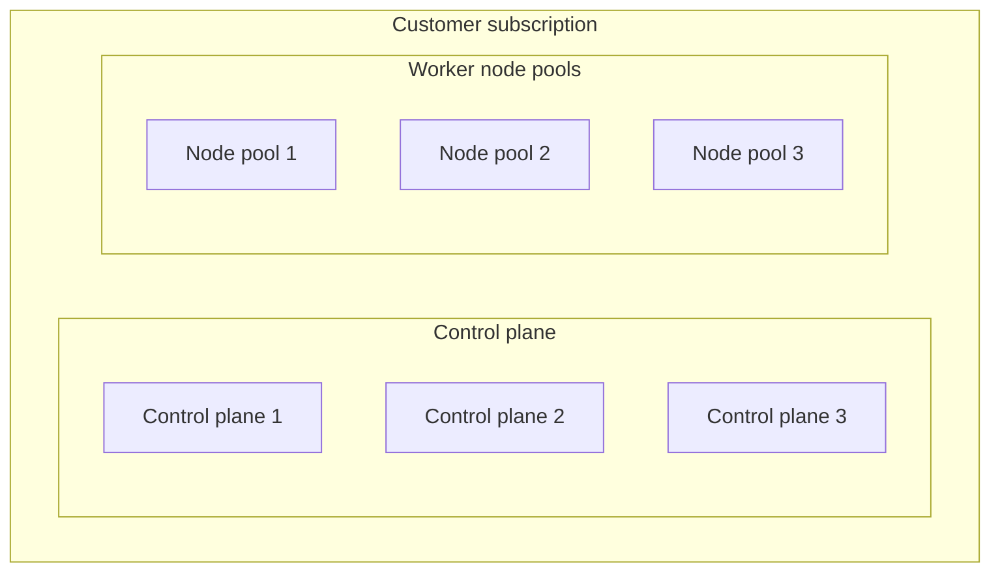
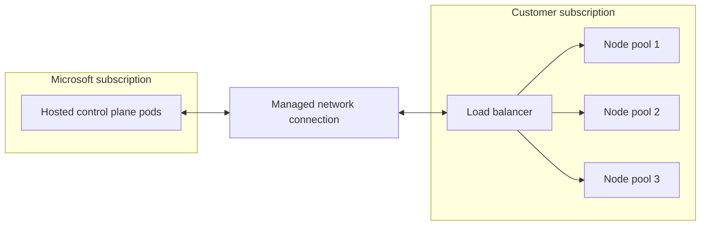
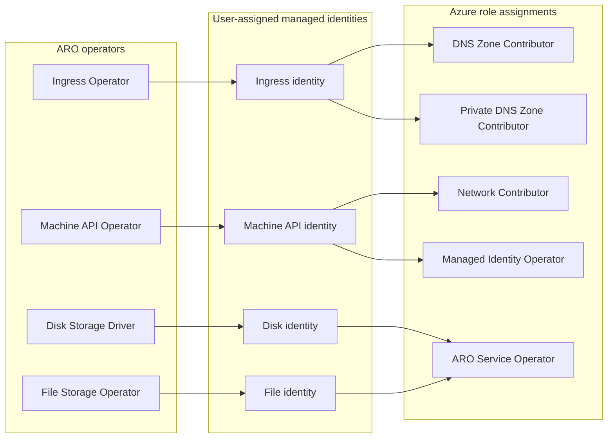
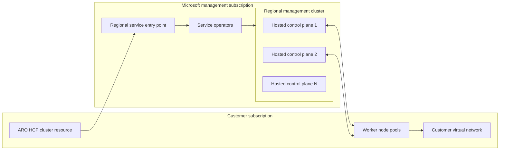

## Architecture overview

### Classic architecture (standard OpenShift)

* The control plane nodes are spread across three availability zones.
* Worker nodes provide the data plane.
* Worker nodes can span node pools.
* The control plane and worker nodes run in the customer subscription.

### ARO HCP architecture

* Hosted control planes is a new deployment option that runs the OpenShift control plane as a fully managed service in a Microsoft-managed Azure subscription, operated by Microsoft and Red Hat site reliability engineers (SREs), separate from the worker nodes that run your applications.
* The control plane runs inside a Microsoft subscription.
* Everything else runs in the customer subscription as managed resources.
* A networking path connects the hosted control plane to the customer cluster.
* Traffic flows between the control plane pods and the customer's load balancer.
* The control plane pod subnet must be specified during installation.
* A private endpoint isn't required during installation.
* This deployment option helps organizations accelerate application modernization, increase developer velocity, streamline operations, and strengthen security while maintaining the familiar OpenShift experience
* Azure Red Hat OpenShift with standard architecture remains fully supported and actively developed

## Advantages

* Whether it’s reducing complexity with a unified platform for AI-enabled applications, offloading ongoing infrastructure management to a team of Red Hat SREs, or managing different workloads alongside VMs and containers, Azure Red Hat OpenShift provides a robust foundation to build, deploy and manage applications at scale
* Lower customer cost because customers don't pay for three dedicated control plane nodes
* Cost-effective operation at a smaller cluster size
* Fewer customer-managed resources
* Less virtual machine management
* Fewer platform components to operate
* A more seamless customer experience
* Microsoft manages control plane quotas and infrastructure.
* The topology makes additional managed features possible.
* Organizations can modernize at their own pace and run virtual machines, containers, and cloud-native applications on a single platform while extending existing applications for AI-ready workloads.
* Hosted control planes also help developers move faster. Clusters provision in minutes, and development and test environments can scale down during idle periods and scale back up when needed.
* This enables teams to accelerate experimentation, shorten testing cycles, and bring applications to production more quickly while optimizing infrastructure spend.
* To support growing multi cluster environments, hosted control planes simplify platform operations and provide greater flexibility and control.
* Independent control plane and worker node lifecycles give organizations more control over application upgrade timing while Microsoft and Red Hat manage the underlying platform. Organizations can scale clusters across teams, environments, and regions, customize networking with bring-your-own container network interface (CNI), and maintain operational consistency without increasing management complexity.

## Upgrades

There are three upgrade areas to consider.

### Control plane

* Control plane upgrades are independent from node pool upgrades.
* Customers can select the control plane version.
* Customers have visibility into upgrade channels and available versions.
* The control plane can be upgraded without updating every node pool at the same time.
* The service manages control plane updates and the control plane data plane.

### Node pools

* Node pools can run a version that differs from the control plane version within the supported skew policy.
* Customers can choose when to upgrade each node pool.
* New node pools can be created at a newer version.
* Workloads can be migrated to the new node pool before the old node pool is removed.
* Customer-selected maintenance windows can help coordinate upgrades.

### Cluster upgrade policy

* Platform upgrades can be coordinated independently from workload upgrades.
* Upgrade policies should account for version skew, support windows, and maintenance schedules.

## Identity management

ARO HCP uses an identity and role-assignment architecture based on managed identities and workload identity.

### Azure Red Hat OpenShift operators

The architecture includes identities for these operators:

* OpenShift Ingress Operator
* OpenShift Machine API Operator
* OpenShift Disk Storage Driver
* OpenShift File Storage Operator

Typical role assignments include:

* DNS Zone Contributor
* Private DNS Zone Contributor
* Network Contributor
* Managed Identity Operator
* Azure Red Hat OpenShift Service Operator

### Identity behavior

* Only managed identity and workload identity are supported.
* Operators and workloads use separate identities.
* Each service principal or identity receives only the permissions it requires.
* Customers can use their own managed identities.
* The service uses Azure role assignments rather than long-lived credentials.

### Identity of the control plane

* The control plane identity is configured by the service.
* Node pool operators use user-assigned managed identities.
* Workload identity supports OpenID Connect-based federation.
* An identity provider can be configured independently from the cluster's infrastructure identities.
* Customers can control application access through Microsoft Entra ID and OpenShift role-based access control.

### Identity provider

* An OpenID Connect identity provider is optional.
* Cluster identity is separate from workload identity.
* Role assignments can be scoped to the resources required by each operator.

## Versions and regions

### Version benefits

* Customers can deploy supported ARO HCP versions through channels.
* Customers can follow the latest supported version.
* Upgrade channels include fast, stable, and long-term support channels where available.
* Fast-channel releases progress to stable after validation.
* Version support and regional availability depend on customer demand and service rollout.

### Planned regions

* Australia East
* Brazil South
* Canada Central
* Central India
* Switzerland North
* East US 2
* West Europe

## Cluster features

* The service is API-first, with CLI and Azure portal experiences planned afterward.
* The customer chooses the cluster configuration during deployment.
* Hosted control planes are highly available.
* Worker node pools can span availability zones.
* Public and private API server configurations are supported.
* Public clusters can restrict access to the API server.
* Private API servers use private network connectivity.
* Cluster networking is configured independently from the hosted control plane infrastructure.

### API server access

#### Public

The API server is exposed through a public IP address.

#### Private

The API server is reachable through private network access.

### Node provisioning

* Node provisioning is managed through node pool resources.
* Customers can create a cluster before creating node pools.
* Node pools can be added, scaled, upgraded, or removed independently.
* Node pool configuration is validated before provisioning.

## Node pool features

Worker nodes are represented by node pool resources that are separate from the cluster resource.

### Supported operations

* Create a cluster with no node pools.
* Add node pools after cluster creation.
* Get node pool status and configuration.
* Scale a node pool manually or through autoscaling.
* Upgrade node pools independently.
* Delete a node pool without deleting the cluster.

### Per-node-pool configuration

* Virtual machine size
* OpenShift version
* Region and availability zones
* Operating system disk size
* Disk type and disk encryption
* Node drain timeout
* Maximum pods per node
* Autoscaling settings
* Node labels
* Node taints
* Node administrator configuration

### Scale and limits

* A cluster can support multiple node pools.
* The design target is up to 500 worker nodes per cluster.
* Capacity and scale limits depend on the selected virtual machine size and regional quota.
* Control plane sizing is managed by the service as workload scale changes.

## Demo environment

The HCP development demo creates resources across service-managed and customer-managed resource groups.

### Managed resource group contents

* Load balancer
* Public IP addresses sized for cluster scale
* Availability sets or availability-zone resources for node pools
* DNS zones
* Private DNS zones
* Storage resources
* Virtual network
* Network interfaces
* Operating system disks

The hosted control plane infrastructure is deployed outside the customer cluster resource group.

### Infrastructure roles

* Network Contributor
* Managed Identity Operator
* DNS Zone Contributor
* Private DNS Zone Contributor

## Roadmap

### Public preview

* Introduce the hosted control plane architecture as a new ARO deployment model.
* Keep the Azure resource experience aligned with ARO where possible.
* Build on hosted control plane concepts already available in Red Hat OpenShift Service on AWS.
* Expand regional support in response to customer demand.

### Customer value

In classic ARO, customers pay for three control plane nodes in addition to worker nodes. With ARO HCP, the hosted control plane runs in a Microsoft-managed subscription, and customers primarily pay for their worker capacity and the applicable cluster management fee.

The model provides these benefits:

* Lower entry cost for smaller clusters
* Independent control plane and worker node lifecycle management
* Reduced customer responsibility for control plane infrastructure
* Better support for API-driven node pool management
* Greater flexibility for Terraform and other automation workflows

### Initial regional rollout

* South Central US
* Canada Central
* Australia East
* Switzerland North
* Brazil South
* Central India
* East US 2
* West Europe

## Architecture comparison

### ARO classic

* The control plane and workers run in the customer subscription.
* The customer pays for dedicated control plane nodes.
* Control plane and worker upgrades are more tightly linked.
* More infrastructure is visible to the customer.
* Node pool management uses cluster-oriented operations.

### ARO HCP

* The control plane runs in a Microsoft-managed subscription.
* Workers run in the customer subscription.
* The control plane uses the hosted service model.
* The control plane and node pools have independent lifecycles.
* Microsoft manages the hosted control plane infrastructure.
* Dedicated node pool resources and APIs manage worker capacity.

## Management architecture

The service separates customer-facing resources from regional hosted control plane infrastructure.

### Customer subscription

* Contains the customer-facing ARO HCP cluster resource.
* Contains worker node pools and customer networking resources.
* Retains workload data and application resources.

### Management subscription

* Contains service control and hosted service resources.
* Uses regional management clusters.
* Hosts multiple control planes as isolated pods.
* Shards hosted control planes based on scale and performance requirements.
* Keeps individual control plane infrastructure out of the customer subscription.

### Management cluster characteristics

* Provides the service entry point and logical operators.
* Records operational interactions.
* Delegates required permissions to service components.
* Hosts many control planes in a shared regional management cluster.
* Uses separate shards to isolate scale and performance domains.
* Scales according to the number of clusters and worker nodes in the region.
