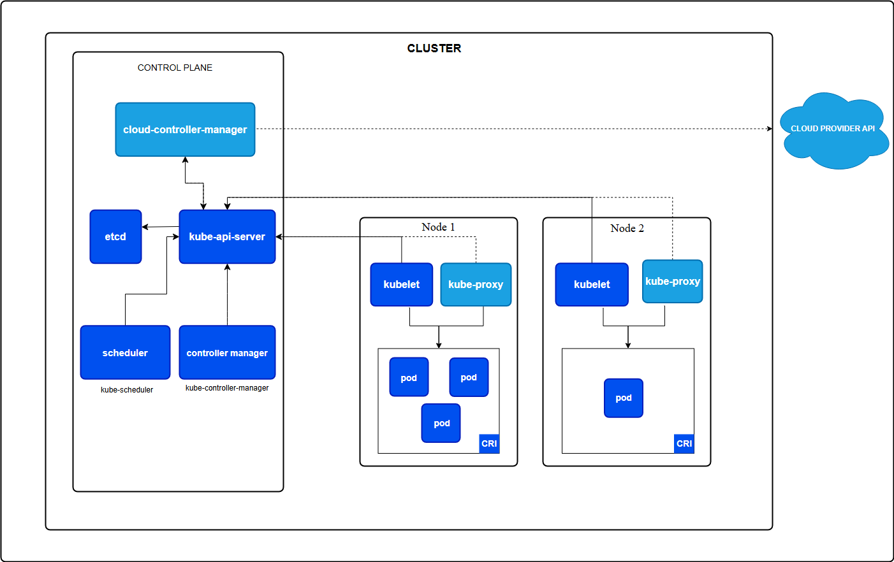

# Fundamentals

## Kubernetes Architecture

- A container can is a lightweight, portable, and deployment of software that includes everything needed to run an application
- Azure Container Registry (ACR) which is a private registry that offers several features such as geo-replication, integration with Microsoft Entra ID, artifact streaming, and even continuous vulnerability scanning and patching
- Can use open-source tool like Draft or lean on AI tools like GitHub Copilot to help you create a Dockerfile
- Following command to create a Dockerfile for Applications: `draft create --dockerfile-only --interactive`
  - Using the --interactive flag will prompt you for the port that the application will listen on and the version to use.
  - Draft can also help create Kubernetes manifest files, but the --dockerfile-only flag tells Draft to only create the Dockerfile
- The Dockerfile is a set of instructions that tells Docker how to build the container image. The `FROM` instruction specifies the base image to use. The `ENV` instruction sets an environment variable, and the `EXPOSE` instruction tells Docker which port the application will listen on.
- Run the following command to build the container image: `docker build -t name:latest` .
- With the container image built,can now run it locally: `docker run -d -p 3000:3000 --name contoso-air name:latest`
- Can use ACR tasks to execute remote builds
  - This command will package the application source code, push it up to Azure, build the image, and save it in the registry.
  - This is another way to build images in the cloud without needing to have Docker installed locally.
  - `az acr build --registry $ACR_NAME --image name:latest . --no-wait`

## Kubernetes workload resources

Kubernetes is a container orchestrator, but it doesn't run containers directly. Instead, it runs containers inside a resource known as a **Pod**. **A Pod is the smallest deployable unit in Kubernetes**. It is a logical host for one or more containers which runs your application.

But even then, a Pod is not what you want to deploy because a Pod is not a long-lived resource. Meaning, if a Pod dies, Kubernetes will not attempt to restart it.

Instead, you need to use a workload resource to manage Pods for you. There are several different types of workload resources in Kubernetes that manages Pods, each with its own use case and knowing when to use each is important.

The most common types of workload resources are:

- **Deployment** resource is a declarative way to manage a set of Pods. It in turn creates a ReplicaSet resource to manage the Pods. A Deployment is used for stateless applications and is the most common way to deploy applications in Kubernetes.
- **ReplicaSet** resource is a low-level resource that is used to manage a set of Pods. It is used to ensure that a specified number of pod replicas are running at any given time. A ReplicaSet is mostly used by the Deployment resource to manage the Pods. You typically won't use a ReplicaSet directly, but it's important to understand how it works.
- **StatefulSet** resource is used to manage stateful applications. It is used for applications that require stable, unique network identifiers and stable storage. A StatefulSet is used for applications that require persistent storage and stable network identities, such as databases. A stateful set is a workload resource that is used to manage stateful applications. It is used for applications that require stable, unique network identifiers and stable storage.
- **DaemonSet** resource is often used to ensure that a copy of a Pod is running on all nodes in the cluster, such as logging or monitoring agents.
- **Job** resource is a workload resource that is used to run a batch job. These are applications that need to run to completion, such as data processing jobs.
- **CronJob** resource is a workload resource that is used to run a batch job on a schedule, such as backups or report generation.

The workload resource that you request are reconciled by various controllers in the Kubernetes control plane. For example, when you create a Deployment, the Deployment controller will create a ReplicaSet and the ReplicaSet controller will create the Pods.

When you submit a resource through the Kubernetes API server, the desired state is stored in etcd and controllers are responsible for ensuring that the actual state matches the desired state. This is known as the reconciliation loop.

Each resource type is it's own API in Kubernetes and has it's own set of properties which you set in a manifest file written in YAML or JSON. Once the manifest file is created, you can use the kubectl CLI to create the resource in the cluster.

## kubectl to interact with the cluster

- See config file: `kubectl config view --raw`
- Kubernetes Api Server: `kubectl api-resources`
- Can also use the `--recursive` flag to see all the available attributes for the resource: `kubectl explain deployment --recursive`

## Multi-container Pod design patterns (e.g. sidecar, init and others)

- Pod can contain one or more containers that share the same network namespace and storage volumes.
- You can think of a Pod as a small VM where apps can communicate with each other and share data.

### Sidecar

- The design pattern of running multiple containers in a Pod, is often referred to as the "sidecar pattern"
- useful when you have a main application container with one or more containers that provide additional functionality such as logging, monitoring, caching, networking, etc.
- Some challenges faced included the fact that the sidecar container would not be restarted if it failed, or guaranteeing that the sidecar container would be started before the main application container.
- This made it difficult to use sidecar containers for certain scenarios
- With Kubernetes v1.28 and later, Kubernetes native sidecar container support was introduced
- This allows you to run a sidecar container as an `initContainer` with the `restartPolicy: Always` attribute
- means that the sidecar container will always be restarted if it fails, and it will run before the main application container starts which addressed a lot of challenges with the previous approach of using a sidecar container

## Persistent Volumes and Persistent Volume Claims

- If you need data to persist beyond the life of a Pod, you would create a Persistent Volume (PV) which is allocatable storage within the cluster, and Persistent Volume Claim (PVC) to make a claim on the piece of storage
- In AKS, Azure CSI drivers and storage classes can dynamically provision Azure Storage resources such as Azure Managed Disks or Azure File Shares to be used as PVs.
- To see Storage classes: `kubectl get storageclasses`
- The `azurefile-csi` storage class is used to create **Azure File Shares** and the `managed-csi` storage class is used to create **Azure Managed Disks**.