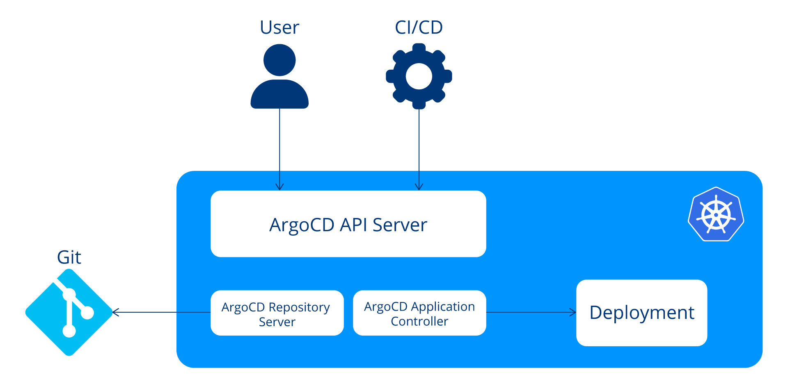
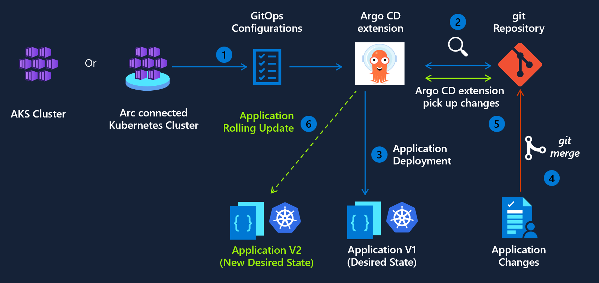
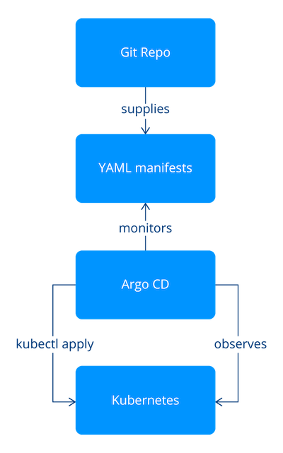

# Gitops

- Developer centric approact to deploy an application
- Continuous delivery deployment to Kubernetes environment in autonomus way

## What is GitOps

- GitOps is a collection of principles that guide modern software delivery and operations.
- It provides a structured, reliable way to manage infrastructure and applications through version control.
- There are 5 key aspects of GitOps that streamline, standardize, and optimize development and deployment.
  - **Declarative configuration**
    - Defining the desired state of your system rather than how to get there.
    - In practice, developers describe the intended outcome
    - E.G. an application should run three containers. Automated agents then compare the current system state to this desired configuration and make the necessary adjustments, such as adding or removing containers. This approach contrasts with the traditional imperative style, in which specific commands are issued step by step to achieve the desired setup.
  - **Immutable storage**
    - In GitOps, the Git serves are a version-control system and also as an immutable storage for configurations.
    - Once a configuration is committed to Git, it becomes a fixed reference point, providing a reliable record that supports reproducibility and traceability
    - Making Git the single source of truth for your system’s desired state. 
    - Although Git is the most commonly used tool for this purpose, the core principles of GitOps can also be applied with other version control systems.
  - **Automation**
    - Focuses on removing manual steps after changes are committed to version control.
    - Once an update is made, software agents take over, analyzing the difference between the system’s current state and the desired state defined in the repository.
    - They then apply the necessary changes to implement the newly declared configuration, bringing the system into alignment.
    - This continuous reconciliation process represents the closed-loop nature of GitOps, ensuring that deployments remain consistent, reliable, and up to date without human intervention.
  - **Closed loop**
    - The continuous feedback process that compares the system’s actual state with its desired state.
    - Automated agents constantly monitor for differences between the two and take corrective action whenever the system drifts from the configuration defined in version control.
    - This ensures the environment is always moving toward the declared state, maintaining consistency, reliability, and predictability in operations.

## ARGO

- Argo is a set of Kubernetes native tools that enhance the workflow management capabilities of Kubernetes. 
- Argo is made up of:
  - **Argo Continuous Delivery** (CD) for state management
  - **Argo Workflows** for running complex jobs
  - **Argo Events** for event-based dependency management
  - **Argo Rollouts** for progressive delivery
- These tools are designed to help you automate and manage tasks in a Kubernetes environment, making it easier to deploy, update, and manage applications.
- Each of these tools can run independently and do not require the others to work, but they are capable of working together.

### Benefits of Argo

- Argo is an open-source toolset that makes GitOps easier to use with Kubernetes.
- It helps teams deploy in a safer and more reliable way, while reducing manual work.
- Tools like Argo CD and Argo Rollouts make advanced release patterns easier, including canary and blue-green deployments.
- Argo automation helps teams ship features faster and roll back quickly when checks show something is wrong.
- Since everything is tracked in Git, you get a clear audit trail of changes. 
- Argo also works well with tools like Prometheus, Helm, NATS, and CloudEvents.

### Argo CD

- Declarative GitOps continuous delivery (CD) tool designed for Kubernetes.
- Automates the process of applying Kubernetes manifests from a Git repository to a cluster and continuously monitors the repository for changes.
- When updates are detected, Argo CD automatically synchronizes the cluster to match the desired configuration defined in Git.
- This makes it an ideal tool for managing both infrastructure and application deployments, ensuring that production environments always reflect the exact state specified in version control.

#### Key Advancements

- GitOps control
  - Argo CD keeps your applications aligned with the desired state defined in Git.
  - Every change is version-controlled, auditable, and easy to track over time.
  - Compared to direct cluster changes, this gives teams better consistency and governance.
- Continuous delivery
  - Argo CD watches your Git repository and automatically syncs approved changes to Kubernetes.
  - This reduces manual `kubectl apply` steps and lowers deployment risk.
  - It also improves delivery speed and makes release activity easier to trace.
- Safer rollbacks
  - If a deployment causes issues, Argo CD can quickly roll back to a known good version.
  - In standard Kubernetes workflows, this is usually more manual and slower to recover.
- Multi-environment management
  - Argo CD helps you manage Dev, Staging, and Production from one Git-based workflow.
  - This reduces drift between environments and improves operational reliability.
- UI and API support
  - Argo CD includes both a clear web UI and a strong API for automation.
  - Teams can monitor, manage, and troubleshoot releases without relying only on CLI commands.

#### Core components

- Controllers
  - Argo CD relies on Kubernetes controllers for its core behavior.
  - These controllers continuously monitor cluster state and compare it with the desired state.
  - When drift is detected, they trigger changes to bring resources back in line.
  - This works by watching Kubernetes objects, where the intended state is defined in the `spec` field.
- API Server
  - The Argo CD API server is the central communication layer.
  - It connects the Web UI, CLI, Argo Events, and external CI/CD systems.
  - It tracks application state, reports status, and triggers operations when updates are required.
  - It also manages repository and cluster connections, linking your Git source to your runtime environment.
  - From a security standpoint, it handles authentication, supports Single Sign-On (SSO), and enforces Role-Based Access Control (RBAC).
  - In short, it is the main control plane for Argo CD operations.
- Repository Server
  - The Argo CD Repository Server works with the API server to retrieve desired application state from Git.
  - It pulls manifests and prepares them in a format Kubernetes can apply.
  - It maintains a local cache of repository content to improve performance and reduce repeated fetches.
- Application Controller
  - The Application Controller is responsible for reconciliation.
  - It continuously compares desired state from Git with live state in the cluster, based on the Application CRDs.
  - If it finds a difference, it takes corrective action so the live environment matches the target state.



#### Argo CD extension on AKS

- GitOps with Argo CD is currently in PREVIEW
- GitOps is becoming the standard for deploying and operating applications at scale
- Enterprises need a way to implement GitOps while staying compliant with best practices for security and identity management
- Also available on Azure Arc enabled Kubernetes clusters
- Argo CD extension delivers on this need across 3 pillars
  - Trusted Identity and Secure Access
    - The Argo CD extension works with Microsoft Entra ID to give teams secure access.
    - It supports Workload Identity federation with Azure Container Registry (ACR) and Azure DevOps, so you do not need long-lived credentials or hard-coded secrets in Git repos.
    - It also supports Single Sign-On (SSO) using existing Azure identities.
  - Enterprise-Grade Hardening and Security
    - To reduce security risk, the extension images are built on Azure Linux.
    - You can opt in to automatic patch updates to stay current on fixes while still controlling your change process.
  - Parity with upstream Argo CD
    - The extension stays aligned with upstream Argo CD, so teams can use familiar Argo CD features.
    - It supports high availability (HA) setups for critical production workloads.
    - It supports hub-and-spoke designs for multi-cluster GitOps.
    - It supports Application and ApplicationSet for automated app delivery across many clusters.



#### Argo CD Reconciliation Loop

- The  reconciliation process involves aligning the intended configuration specified in a Git repository with the current state in the Kubernetes cluster
- In practice, reconciliation means Argo CD keeps the live cluster aligned with what is defined in Git.
- When Helm is used, Argo CD reads the Git repo, renders manifests from Helm templates, and compares those manifests with the live cluster state (sync status).
- If drift is detected, Argo CD applies the required changes with kubectl apply to move the cluster back to the target state.
- Argo CD uses kubectl apply instead of helm install so it can support multiple templating approaches while staying tool-agnostic.
- This reconciliation loop is a direct implementation of GitOps principles: Git as the single source of truth, declarative and versioned configuration, and continuous automated convergence of live state to desired state.



##### Synchronization Principles

- The sync phase is one of the most important Argo CD operations. Its behavior can be customized with resource hooks and sync waves.

- Resource hooks
  - A sync is the process of moving an application to its target state.
  - Argo CD supports five hook phases:
    - PreSync: Runs before sync starts (for example, create a backup).
    - Sync: Runs during manifest application after all PreSync hooks succeed (for example, advanced rollout logic such as blue-green or canary).
    - PostSync: Runs after sync succeeds and resources are healthy (for example, integration or post-deployment health checks).
    - Skip: Tells Argo CD to skip applying a manifest.
    - SyncFail: Runs when sync fails (for example, cleanup operations).
  - Hooks commonly use Kubernetes `Job` resources and are identified through annotations.

```yaml
apiVersion: batch/v1
kind: Job
metadata:
  generateName: schema-migrate-
  annotations:
    argocd.argoproj.io/hook: PreSync
```

- Sync waves
  - Sync waves let you control deployment order across manifests.
  - Wave values can be negative or positive and are applied from lowest to highest.
  - If no wave is set, the default is wave `0`.
  - Waves are configured with annotations, similar to hooks.

```yaml
metadata:
  annotations:
    argocd.argoproj.io/sync-wave: "5"
```

- How Argo CD orders and applies resources
  - Hooks and waves can be used together.
  - During sync, Argo CD orders resources using:
    - Hook phase annotation
    - Sync wave annotation
    - Kubernetes kind (for example: namespaces first, then other resources, then custom resources)
    - Resource name
  - Argo CD then selects the lowest wave that still has out-of-sync or unhealthy resources and applies that wave.
  - This continues until all phases and waves are synced and healthy.

- Operational note
  - If resources in the first wave remain unhealthy, the application may never reach a healthy state.
  - Argo CD adds a 2-second delay between waves by default for safety.
  - You can change this delay with the `ARGOCD_SYNC_WAVE_DELAY` environment variable.


#### Key terminology

- Configuration
  - In Argo CD, this is the `Application` custom resource (CRD) that defines the Kubernetes resources to deploy.
  - It is the main object Argo CD uses to manage deployed software.
- Application source type
  - The build/deploy source Argo CD uses, for example Helm or Kustomize.

- Core states
  - Target state: The desired application state defined in Git (source of truth).
  - Live state: The current state running in the Kubernetes cluster.

- Core statuses
  - Sync status: Shows whether live state matches target state.
  - Sync operation status: Shows whether the current sync operation succeeded or failed.
  - Health status: Shows whether the app is running correctly and able to serve requests.

- Core actions
  - Refresh: Re-checks Git and cluster state to detect differences.
  - Sync: Applies changes to move the app from live state to target state.

#### Securing Argo CD

- Use RBAC
  - Why: RBAC is one of the most important controls in Argo CD. It ensures only authorized users can access or change specific resources, which reduces the risk of unauthorized deployments and configuration drift.
  - How: Define role permissions in the argocd-rbac-cm ConfigMap based on real team responsibilities. Map roles to users or groups with RoleBindings or ClusterRoleBindings. Apply least privilege, review permissions regularly, and test policies to confirm access behaves as expected.

- Manage secrets securely
  - Why: Secrets such as API keys, passwords, and certificates are high-risk assets. Poor handling can lead to credential exposure and security incidents.
  - How: Store sensitive data using Kubernetes Secrets and ensure encryption at rest and in transit. Add stronger controls where needed, such as Kubernetes encryption features, environment-level protections, or integration with an external secrets manager.

- Regularly update Argo CD
  - Why: Updates include security patches, bug fixes, and platform improvements. Staying current lowers exposure to known vulnerabilities and improves reliability.
  - How: Set a regular update process using release monitoring or automated checks. Roll out updates with standard Kubernetes deployment practices, validate in a staging environment first, then promote to production.

#### Custom Resource Definitions (CRDs)

- Application
  - The `Application` CRD represents the app instance Argo CD deploys and manages in Kubernetes.
  - It defines source details (repo, revision, path), destination details (cluster, namespace), and sync-related settings.
  - Example:

```yaml
apiVersion: argoproj.io/v1alpha1
kind: Application
metadata:
  name: guestbook
  namespace: argocd
spec:
  project: default
  source:
    repoURL: 'https://github.com/argoproj/argocd-example-apps.git'
    targetRevision: HEAD
    path: guestbook
  destination:
    server: 'https://kubernetes.default.svc'
    namespace: guestbook
```

- AppProject
  - The `AppProject` CRD helps you group applications for organization, policy control, and governance.
  - A common pattern is separating production apps from shared utility services.
  - Example:

```yaml
apiVersion: argoproj.io/v1alpha1
kind: AppProject
metadata:
  name: production
  namespace: argocd
spec:
  description: Production applications
  sourceRepos:
    - '*'
  destinations:
    - namespace: production
      server: 'https://kubernetes.default.svc'
  clusterResourceWhitelist:
    - group: '*'
      kind: '*'
```

- Repository credentials
  - For private Git repositories, Argo CD reads repository credentials from Kubernetes `Secret` objects.
  - The secret must use the label `argocd.argoproj.io/secret-type: repository`.
  - Example:

```yaml
apiVersion: v1
kind: Secret
metadata:
  name: private-repo-creds
  namespace: argocd
  labels:
    argocd.argoproj.io/secret-type: repository
stringData:
  url: 'https://github.com/private/repo.git'
  username: <username>
  password: <password>
```

- Cluster credentials
  - When Argo CD manages additional clusters, it uses a separate secret type for cluster access.
  - The secret must use the label `argocd.argoproj.io/secret-type: cluster`.
  - This enables secure access to external clusters outside the default in-cluster context.
  - Example:

```yaml
apiVersion: v1
kind: Secret
metadata:
  name: external-cluster-creds
  labels:
    argocd.argoproj.io/secret-type: cluster
type: Opaque
stringData:
  name: external-cluster
  server: 'https://external-cluster-api.com'
  config: |
    {
      "bearerToken": "<token>",
      "tlsClientConfig": {
         "insecure": false,
         "caData": "<certificate encoded in base64>"
      }
    }
```

- These core objects (`Application`, `AppProject`, repository credentials, and cluster credentials) are the foundation for managing Argo CD deployments across single or multiple Kubernetes environments.

#### Argo CD Entensions & integrations

- Plugins
  - Argo CD is highly extensible, and plugins let teams add capabilities beyond the default feature set.
  - This makes it easier to adapt Argo CD to different enterprise workflows.
  - A common example is the Notifications plugin, which alerts teams about sync, health, and deployment events.

- Configuring plugins with ConfigMaps
  - In Argo CD, plugin behavior is commonly configured through Kubernetes ConfigMaps.
  - Example using the Notifications ConfigMap:

```yaml
apiVersion: v1
kind: ConfigMap
metadata:
  name: argocd-notifications-cm
data:
  context: |
    region: east
    environmentName: staging

  template.a-slack-template-with-context: |
    message: "Something happened in {{ .context.environmentName }} in the {{ .context.region }} data center!"
```

  - In this example:
    - `context` defines reusable values like region and environment.
    - `template.a-slack-template-with-context` defines a notification template using Go templating.
    - The template references context values so notifications are dynamic and environment-aware.

- How plugins work in Argo CD
  - Plugins follow a lifecycle: registration, initialization, and execution.
  - At startup, Argo CD discovers and loads available plugins.
  - During runtime, events such as sync and deployment trigger the relevant plugin logic.

- Plugins in action
  - Example: a deployment fails in staging (east region).
  - The Notifications plugin can send a Slack or email alert like: "Something happened in staging in the east data center!"
  - This gives teams immediate visibility and shortens response time.


#### Demo

- [link](https://learn.microsoft.com/en-us/azure/azure-arc/kubernetes/tutorial-use-gitops-argocd)
- In this demo, we deploy AKS and install Argo CD as a GitOps extension by running setup.ps1.
- Argo CD uses your Git repo as the source of truth for cluster config and app deployments.
- Argo CD also supports other common sources, including Helm and OCI repositories.
- The script creates the main resources you need: resource group, user-assigned identity, ACR, Log Analytics, Azure Monitor workspace, Application Insights, Key Vault, and AKS.
- AKS is created with OIDC issuer and workload identity enabled.
- Argo CD is installed with the simple extension command in the script:
  - redis-ha.enabled=false
  - configs.params.application.namespaces=namespace1,namespace2
- This means the demo uses single-node Argo CD Redis mode, even though the cluster itself has four nodes.
- Prerequisites:
  - You are logged in to Azure and have permission to create resources and role assignments.
  - Your network allows outbound access to your Git source on port 22 (SSH) or 443 (HTTPS).
  - Argo CD extension supports multi-tenant setups in high availability (HA) mode and also supports workload identity.
  - HA is the default Argo CD extension mode and normally needs four nodes.
  - For single-node extension installs, use redis-ha.enabled=false.
  - Azure CLI extension commands are available in your environment.

#### Alternative: Managed Identity (Workload Identity)

- For production, you can deploy the Argo CD extension with workload identity instead of simple mode.
- In this model, Argo CD uses a user-assigned managed identity and federated credentials, so you do not keep long-lived secrets in Git.
- You deploy this option with a Bicep template and set values like:
  - azure.workloadIdentity.enabled=true
  - azure.workloadIdentity.clientId=<managed-identity-client-id>
  - azure.workloadIdentity.entraSSOClientId=<entra-app-client-id>
  - configs.cm.oidc.config=<oidc-settings>
- If you choose HA for Argo CD, keep redis-ha.enabled=true and ensure the cluster has enough nodes.
- If you need single-node extension install, set redis-ha.enabled=false.

### Argo Workflows

- Argo Workflows extends Kubernetes with a Workflow resource that works a lot like a Kubernetes Job, but gives you more flexibility.
- Because of that, it can be used in many areas, especially machine learning and data pipelines.
- Many teams use it to run complex process flows in a cleaner, more organized way.
- In Argo Workflows, each step runs as its own pod, which makes workflows easier to scale and manage.
- It supports parallel execution, so it works well for data processing and automation. A common example is fan-out/fan-in, where work is split into many tasks, run at the same time, then combined at the end.

### Argo Events

- Event driven workflow automation framework for Kubernetes that helps you trigger Kubernetes objects, Argo Workflows, serverless workloads, and other processes in response to events from various sources such as webhooks, S3, schedules, messaging queues, GCP PubSub, and more.
- It supports events from various sources and allows you to customize business level constraint logic for workflow automation.
- Argo Events has two main components: Triggers and Event Sources.
- Triggers are responsible for executing actions when an event occurs.
- Event Sources are responsible for generating events.
- Use cases of Argo Events include automating research workflows, designing a complete CI/CD pipeline, and automating everything by combining Argo Events, Workflows & Pipelines, CD, and Rollouts.

### Argo Rollouts

- Argo Rollouts is a Kubernetes tool for safer app releases.
- It was created because basic Kubernetes deployments are limited.
- It supports blue-green and canary deployments, can control traffic with service meshes and ingress, and can automatically promote or roll back releases based on checks. This helps teams ship new features to production more safely and with less manual work.

## Tools 
- Flux CD
- Argo CD
- Jenkins
