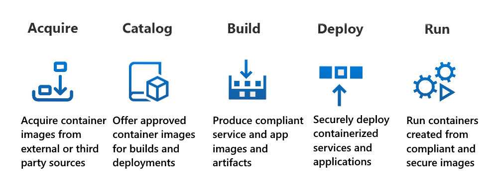

# Container Secure Supply Chain

Containers Secure Supply Chain (CSSC) framework is a seamless, agile ecosystem of tools and processes built to integrate and execute security controls throughout the lifecycle of containers.

As a quick overview, a container supply chain is built in stages to ensure that the container is secure at every stage of the lifecycle. Microsoft identifies these stages in the container supply chain:

